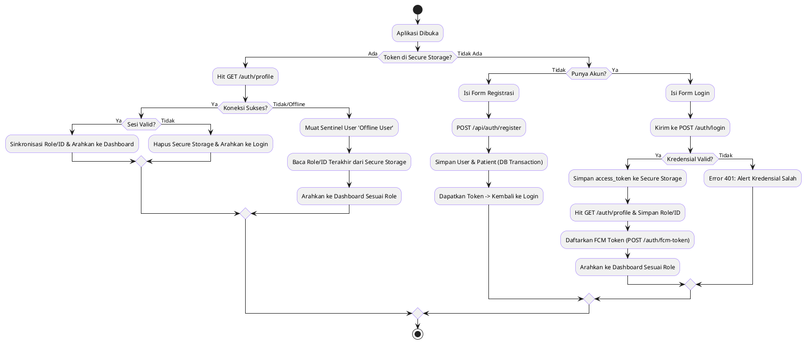
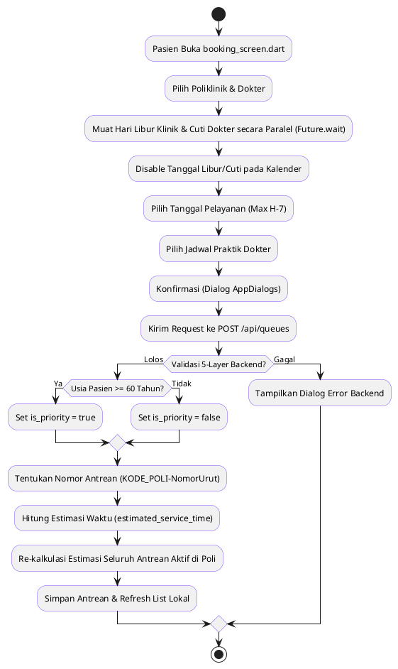
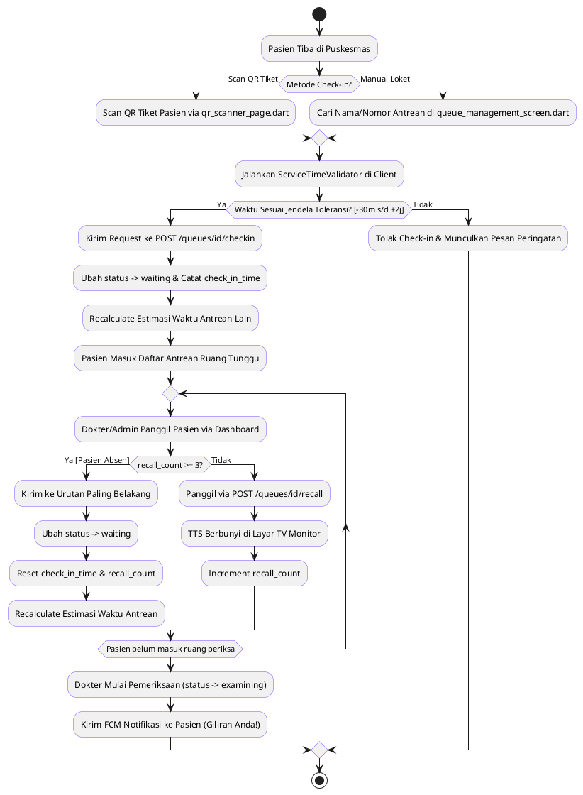
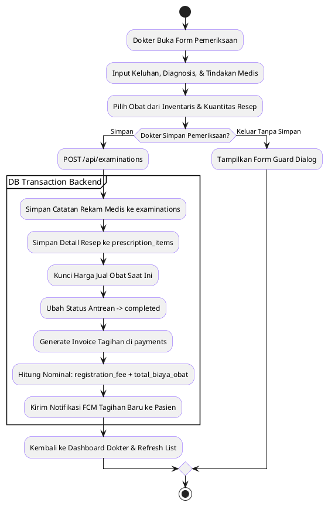
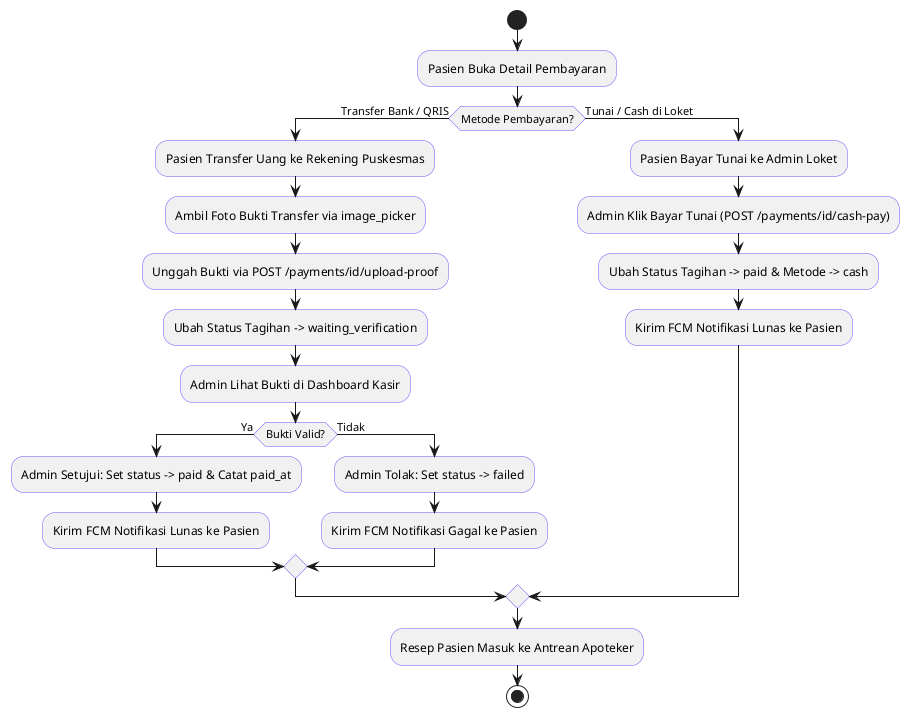
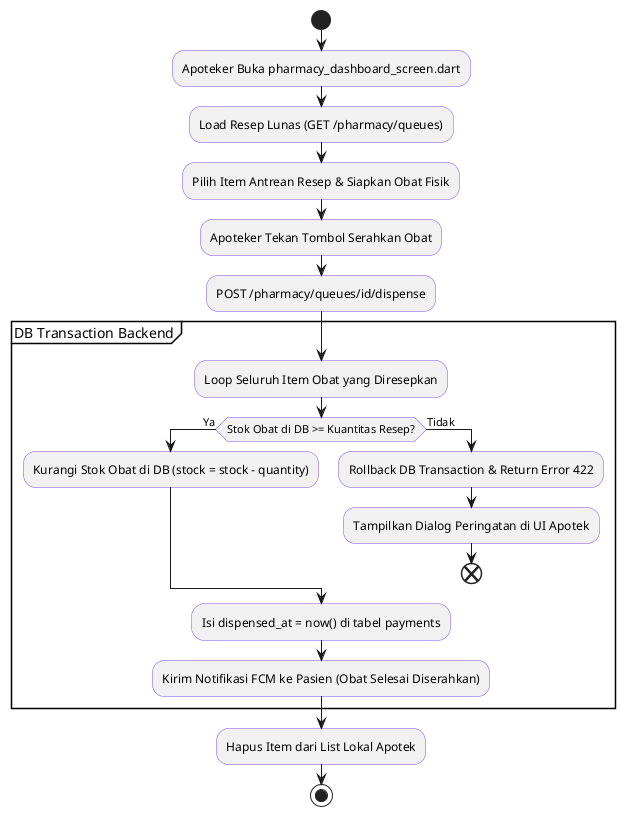
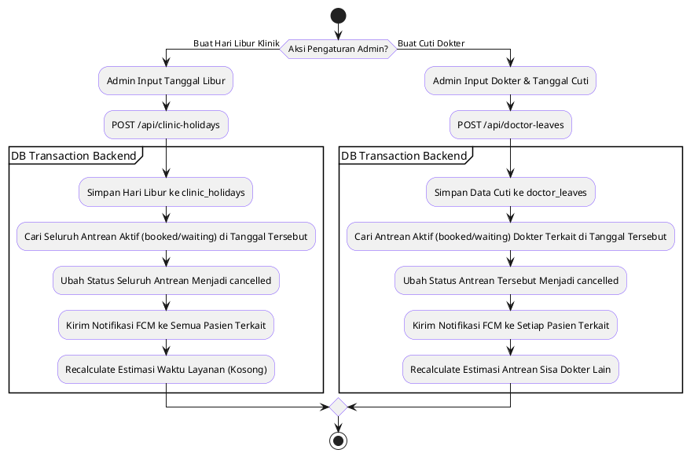

# 🔄 Dokumentasi Alur Bisnis NalaSeva

Dokumen ini merinci seluruh **Alur Bisnis (Business Flows)** yang berjalan pada sistem **NalaSeva** (Aplikasi Manajemen Antrean & Rekam Medis Puskesmas Digital). Alur ini menggambarkan integrasi dinamis antara **Flutter Mobile Client (`nalaseva 3`)** dan **Laravel REST API Backend (`nalaseva api`)** untuk setiap peran pengguna (**Pasien**, **Dokter**, **Apoteker**, dan **Admin**).

---

## 🗂️ Daftar Alur Bisnis
1. [Alur 1: Registrasi, Login & Manajemen Sesi (Session Restore)](#1-alur-registrasi-login--manajemen-sesi-session-restore)
2. [Alur 2: Pemesanan Antrean Mandiri Pasien (Booking Antrean)](#2-alur-pemesanan-antrean-mandiri-pasien-booking-antrean)
3. [Alur 3: Kunjungan & Pelayanan Loket Puskesmas (Hari Kunjungan)](#3-alur-kunjungan--pelayanan-loket-puskesmas-hari-kunjungan)
4. [Alur 4: Pemeriksaan Medis, Resep & Penerbitan Tagihan](#4-alur-pemeriksaan-medis-resep--penerbitan-tagihan)
5. [Alur 5: Pembayaran & Verifikasi Tagihan (Transfer vs Tunai)](#5-alur-pembayaran--verifikasi-tagihan-transfer-vs-tunai)
6. [Alur 6: Penyerahan Obat di Apotek (Dispensing)](#6-alur-penyerahan-obat-di-apotek-dispensing)
7. [Alur 7: Konfigurasi Libur/Cuti & Pembatalan Tiket Otomatis](#7-alur-konfigurasi-liburcuti--pembatalan-tiket-otomatis)

---

## 1. Alur Registrasi, Login & Manajemen Sesi (Session Restore)

Alur ini mengelola siklus masuk akun baru, autentikasi pengguna terdaftar, sinkronisasi token notifikasi (FCM), restorasi sesi offline saat internet terputus, dan pemulihan kata sandi menggunakan OTP 6-digit.

### 📊 Diagram Alir (Flowchart - PlantUML)

### 📝 Penjelasan Detail Langkah-Langkah

#### A. Registrasi Pasien Mandiri
1. Pasien membuka halaman pendaftaran (`register_screen.dart`).
2. Pasien menginput: **NIK (16 digit)**, **Nama Lengkap**, **Email**, **Password**, **Password Konfirmasi**, **Nomor Telepon**, **Jenis Kelamin**, **Tanggal Lahir**, dan **Alamat Tinggal**.
3. Kelas `Validators` memeriksa format email dan teks wajib. Parameter `role: 'patient'` dan `password_confirmation` diinjeksi secara otomatis pada request payload.
4. Data dikirim ke API `POST /api/auth/register`.
5. Backend Laravel memvalidasi keunikan email dan NIK. Melalui **Database Transaction**, server menyimpan baris baru ke tabel `users` (dengan `role = 'patient'`) kemudian baris baru ke tabel `patients` yang berelasi ke `user_id`.
6. Token Sanctum dibuat dan dikembalikan ke client. Pengguna dialihkan ke halaman login untuk masuk.

#### B. Login Pengguna (Semua Role)
1. Pengguna memasukkan Email dan Password pada `login_screen.dart`.
2. Data dikirim ke API `POST /api/auth/login`. Jika email/password tidak cocok, backend melempar exception `401 Unauthorized` yang ditangkap oleh `ErrorParser` untuk ditampilkan di UI.
3. Jika login sukses, token Sanctum (`access_token`) dikembalikan.
4. `AuthProvider` menyimpan token secara terenkripsi ke `FlutterSecureStorage` dengan `key: 'access_token'`.
5. Aplikasi langsung melakukan request ke `GET /api/auth/profile` untuk mengambil data profil lengkap beserta relasi model `patient` atau `doctor`.
6. Sektor ID yang relevan (`patient_id` atau `doctor_id`) dan `user_role` disimpan ke dalam `FlutterSecureStorage` untuk meminimalkan beban re-fetching di masa mendatang.
7. Aplikasi memanggil inisialisasi Firebase Messaging (`!kIsWeb` guard) dan mendaftarkan token perangkat ke backend via `POST /api/auth/fcm-token` untuk pengiriman push notification.
8. Pengguna diarahkan ke dashboard masing-masing.

#### C. Restorasi Sesi Awal (Session Restore / checkAuth)
1. Setiap kali aplikasi pertama kali dimulai, fungsi `checkAuth()` di `AuthProvider` dipanggil di dalam widget root.
2. Aplikasi membaca `access_token` dari `FlutterSecureStorage`.
3. Jika token ditemukan, aplikasi mencoba mengambil profil terbaru dari server melalui `GET /api/auth/profile`.
   - **Kasus Sukses**: Sinkronisasi ulang data role dan ID pasien/dokter di storage lokal.
   - **Kasus Token Kedaluwarsa (Error 401/403)**: Seluruh key di secure storage dihapus (`access_token`, `user_role`, `patient_id`, `doctor_id`) dan pengguna diarahkan ke login screen.
   - **Kasus Jaringan Offline**: Aplikasi menangkap error koneksi secara diam-diam (*silent catch*), membaca data `user_role` offline dari storage, lalu memuat **Sentinel UserModel Offline** (`name: 'Offline User'`) agar pengguna tetap dapat membuka dashboard dan melihat data terakhir yang tersimpan di cache lokal.

#### D. Lupa Password (OTP Flow)
1. Pasien memasukkan Email dan NIK pada `forgot_password_screen.dart`.
2. Request dikirim ke `POST /api/auth/forgot-password/otp`. Backend memeriksa kecocokan Email dan NIK tersebut. Jika sesuai, backend menghasilkan OTP 6-digit acak dengan masa berlaku **15 menit** dan menghapus OTP lama untuk email tersebut. OTP disimpan ke tabel `password_reset_otps`. *(Pada mode non-production, kode OTP dikembalikan langsung pada response JSON untuk pengujian).*
3. Pasien menginput kode OTP 6-digit dan password baru pada form.
4. Data dikirim ke `POST /api/auth/forgot-password`. Backend memvalidasi OTP (benar dan belum kedaluwarsa). Jika valid, password di-hash dan disimpan.
5. Backend menghapus seluruh token Sanctum aktif yang dimiliki oleh user tersebut untuk memutus akses di semua perangkat lain (*force logout*).

---

## 2. Alur Pemesanan Antrean Mandiri Pasien (Booking Antrean)

Alur ini memfasilitasi pasien untuk melakukan pemesanan nomor antrean poliklinik secara mandiri dengan verifikasi ketersediaan dokter, hari libur klinik, dan status prioritas lansia.

### 📊 Diagram Alir (Flowchart - PlantUML)

### 📝 Penjelasan Detail Langkah-Langkah

1. Pasien membuka dashboard pasien (`patient_dashboard.dart`) dan menekan tombol **"Daftar Antrean"** untuk masuk ke `booking_screen.dart`.
2. Pasien memilih **Poliklinik** tujuan. Sistem memuat daftar dokter spesialis yang ditugaskan pada poliklinik tersebut.
3. Pasien memilih **Dokter**. Setelah dokter dipilih, aplikasi memicu panggilan paralel menggunakan `Future.wait`:
   - `getClinicHolidays()`: Mengambil daftar tanggal hari libur klinik.
   - `getDoctorLeaves(doctorId)`: Mengambil daftar tanggal cuti spesifik untuk dokter tersebut.
4. Tanggal-tanggal libur klinik dan cuti dokter yang dikembalikan server dimasukkan ke dalam daftar pengecualian (*blacklist*) di date picker kalender sehingga pasien tidak dapat mengkliknya.
5. Pasien memilih **Tanggal Pelayanan** (pendaftaran dibatasi maksimal **H-7** hingga hari ini).
6. Pasien memilih **Jadwal Dokter** (`doctor_schedule_id`) yang sesuai dengan hari tersebut.
7. Pasien menekan tombol daftar, memicu dialog konfirmasi visual (`AppDialogs.showConfirmationDialog`).
8. Jika dikonfirmasi, data dikirim ke API `POST /api/queues` (dilindungi throttle: maksimal 5 kali per menit per user).
9. Backend memvalidasi data menggunakan **5-Layer Validation Ketersediaan**:
   - *Layer 1 (Hari Libur)*: Tanggal pelayanan tidak boleh beririsan dengan hari libur puskesmas.
   - *Layer 2 (Cuti Dokter)*: Dokter bersangkutan tidak sedang cuti pada tanggal tersebut.
   - *Layer 3 (Konsistensi Jadwal)*: Jadwal yang dipilih harus merupakan milik dokter dan poliklinik tersebut, serta hari pelayanan harus cocok dengan hari praktik jadwal (misal: Senin).
   - *Layer 4 (Duplikat Antrean)*: Pasien tidak boleh memiliki lebih dari 1 antrean aktif di poliklinik yang sama pada hari yang sama.
   - *Layer 5 (Konflik Waktu)*: Jam pelayanan jadwal baru tidak boleh tumpang tindih (*overlap*) dengan jam antrean aktif lainnya yang telah dipesan oleh pasien tersebut di hari yang sama.
   - *Pengecekan Kuota*: Menghitung kapasitas jadwal dinamis (`durasi_praktik / slot_duration_minutes`). Jika antrean aktif pada tanggal tersebut telah penuh, pendaftaran ditolak.
   - *Pengecekan Jam Layanan*: Jika mendaftar untuk hari ini, pendaftaran wajib dilakukan sebelum jam mulai praktik dokter dimulai.
10. **Penentuan Prioritas Otomatis**: Backend secara dinamis menghitung umur pasien berdasarkan `birth_date`. Jika usia **$\ge$ 60 tahun**, antrean otomatis ditandai `is_priority = true`.
11. **Nomor Antrean**: Backend melakukan pencarian nomor urut terakhir pada hari dan poliklinik tersebut (menggunakan `withTrashed()` untuk mencegah tabrakan nomor akibat pembatalan terdahulu), lalu membentuk format `{KODE_POLI}-{NomorUrut}` (contoh: `UMM-001`).
12. **Kalkulasi Estimasi Waktu**: Mengalikan posisi antrean di depan pasien dengan `slot_duration_minutes` (dari pengaturan dinamis).
13. Backend melakukan re-kalkulasi estimasi pelayanan (`estimated_service_time`) untuk seluruh antrean aktif (`booked` dan `waiting`) di poliklinik dan tanggal yang sama untuk menjaga akurasi estimasi waktu di dashboard pasien lain.
14. Tiket berhasil diterbitkan. Client me-refresh state list antrean lokal.

---

## 3. Alur Kunjungan & Pelayanan Loket Puskesmas (Hari Kunjungan)

Alur ini mengatur proses kehadiran fisik pasien di puskesmas, validasi jendela waktu kedatangan, recall antrean terintegrasi audio TTS (Text-to-Speech), dan transisi status saat pasien masuk ke ruang periksa dokter.

### 📊 Diagram Alir (Flowchart - PlantUML)

### 📝 Penjelasan Detail Langkah-Langkah

#### A. Check-in Pasien di Loket
1. Pasien mendatangi loket pendaftaran fisik puskesmas pada hari kunjungan.
2. Admin memverifikasi tiket antrean melalui dua metode:
   - **Pencarian Manual**: Admin mencari data antrean pasien di list `queue_management_screen.dart` berdasarkan nama atau nomor antrean.
   - **QR Code Scanner**: Admin membuka `qr_scanner_page.dart` (berbasis library `mobile_scanner`) dan memindai QR Code yang tertera pada tiket digital pasien (`booking_detail_screen.dart`). QR Code berisi format data `NALASEVA_QUEUE_{id}` atau nomor antrean langsung.
3. **Validasi Waktu Kedatangan (ServiceTimeValidator)**: Sebelum mengirim data ke API, aplikasi memvalidasi waktu check-in di sisi client:
   - Check-in hanya diizinkan pada tanggal kunjungan yang sama.
   - Waktu saat ini harus berada dalam rentang toleransi: maksimal **30 menit sebelum** hingga maksimal **2 jam setelah** `estimated_service_time` pelayanan dokter dimulai.
   - Jika terlalu cepat/lambat, tombol check-in dinonaktifkan atau pemindaian menampilkan dialog error.
4. Jika valid, Admin menekan konfirmasi dan client mengirim request ke `POST /api/queues/{id}/checkin`.
5. Backend Laravel memvalidasi status awal antrean (harus `booked`). Backend mengubah status antrean menjadi `waiting` (menunggu pelayanan) dan mencatat waktu kehadiran pada kolom `check_in_time`.
6. Backend memicu re-kalkulasi estimasi layanan untuk seluruh antrean berjalan.

#### B. Mekanisme Recall & Suara Panggilan TV Monitor
1. Ketika antrean pasien berada di urutan depan, Admin memicu panggilan suara melalui menu antrean.
2. Request dikirim ke `POST /api/queues/{id}/recall`.
3. Di ruang tunggu utama, sebuah perangkat tablet/TV memuat halaman `queue_monitor_screen.dart` (TV Monitor). Halaman ini mendengarkan event panggilan secara asinkron.
4. TV Monitor menggunakan `TtsHelper.speak` (mengaktifkan `flutter_tts` di native Android/iOS atau API `SpeechSynthesis` di platform Web) untuk mengeluarkan suara pembacaan nomor antrean secara lisan (misal: *"Nomor antrean UMM kosong nol satu silakan menuju poliklinik umum"*).
5. **Batas Toleransi Kehadiran (Recall Limit)**:
   - Jika tombol panggil ditekan dan status pasien masih belum masuk ruang periksa, sistem memeriksa jumlah `recall_count`. Jika kurang dari 3, `recall_count` ditambah 1 di database.
   - Jika panggilan telah mencapai **$\ge$ 3 kali** dan pasien tidak kunjung hadir di depan poli, sistem secara otomatis melimpahkan antrean tersebut ke urutan **paling belakang** dengan memperbarui `check_in_time = now()`, mengubah status kembali ke `waiting`, dan menyetel ulang `recall_count = 0`. Sistem kemudian menghitung ulang estimasi antrean lainnya.

#### C. Masuk Ruang Periksa (Examining)
1. Dokter memanggil pasien masuk ke ruang periksa melalui `doctor_dashboard.dart`.
2. Request dikirim ke `PUT /api/queues/{id}` dengan status `examining`.
3. Backend memvalidasi status dokter (harus online `is_online = true`) dan memastikan tidak ada pasien lain yang masih aktif diperiksa (`examining`) di poliklinik dan dokter yang sama.
4. Backend memperbarui status antrean menjadi `examining`, mencatat `called_time = now()`, dan mengirimkan **Notifikasi FCM ke Pasien**: *"Giliran Anda! Silakan memasuki ruang periksa."*

---

## 4. Alur Pemeriksaan Medis, Resep & Penerbitan Tagihan

Alur ini mengelola pencatatan rekam medis oleh dokter, penulisan resep obat terstruktur, transisi status antrean selesai, dan kalkulasi tagihan secara otomatis.

### 📊 Diagram Alir (Flowchart - PlantUML)

### 📝 Penjelasan Detail Langkah-Langkah

1. Pasien berada di dalam ruang periksa bersama Dokter.
2. Dokter membuka form pemeriksaan medis pada halaman `examination_form_screen.dart`.
3. Dokter menginput: **Keluhan Utama**, **Hasil Diagnosis**, dan **Tindakan Medis**.
4. Dokter menyusun resep obat digital dengan memilih jenis obat dari daftar inventaris obat aktif, menentukan **Kuantitas Obat**, dan menambahkan **Instruksi Pemakaian** (contoh: *"3 x 1 tablet setelah makan"*).
5. *Pelindung Form (Form Guard)*: Jika dokter tidak sengaja menekan tombol kembali (*back button*) saat form telah terisi sebagian, sistem memicu dialog konfirmasi peringatan visual agar data tidak hilang.
6. Dokter menekan tombol **"Simpan Pemeriksaan"**. Request dikirim ke `POST /api/examinations`.
7. Backend Laravel mengeksekusi proses penyimpanan menggunakan **Database Transaction (`DB::beginTransaction()`)** untuk menjamin konsistensi data:
   - **Rekam Medis**: Menyimpan baris rekam medis baru di tabel `examinations` dengan mengunci `doctor_id` sesuai ID dokter yang sedang login (keamanan anti-spoofing).
   - **Detail Resep**: Menyimpan setiap obat resep ke tabel `prescription_items`. Backend membaca harga obat saat ini dari tabel `medicines` dan menyimpannya langsung ke tabel detail resep untuk **mengunci harga transaksi jual** (melindungi dari perubahan nominal tagihan jika di masa mendatang harga obat di inventaris mengalami penyesuaian).
   - **Status Antrean**: Status antrean diubah secara otomatis menjadi `completed`.
   - **Penerbitan Invoice**: Sistem membuat baris tagihan baru di tabel `payments` dengan nomor invoice unik (format: `NS-PAY-YYYYMMDD-XXXXXX`) dengan status awal `pending`.
     - *Nominal Tagihan* dihitung dari formula: `registration_fee` (dari konfigurasi sistem) + `total_biaya_obat` (jumlahan `quantity * harga_obat_terkunci`).
   - **Notifikasi FCM**: Sistem mengirim push notification ke HP Pasien terkait: *"Tagihan Baru Diterbitkan. Silakan lakukan pembayaran tagihan sebesar Rp..."*
8. DB Transaction dilakukan commit. Halaman dokter kembali ke dashboard dan menyegarkan state.

---

## 5. Pembayaran & Verifikasi Tagihan (Transfer vs Tunai)

Alur ini mengelola pelunasan tagihan pengobatan pasien melalui dua metode: non-tunai (upload bukti transfer) dengan peninjauan Admin, atau pembayaran tunai langsung di loket kasir puskesmas.

### 📊 Diagram Alir (Flowchart - PlantUML)

### 📝 Penjelasan Detail Langkah-Langkah

#### A. Metode Pembayaran Non-Tunai (Transfer/QRIS)
1. Pasien membuka menu riwayat pembayaran pada halaman `payment_list_screen.dart` dan memilih tagihan yang berstatus `pending`.
2. Pasien melakukan transfer dana sesuai nominal tagihan ke rekening bank resmi puskesmas yang tertera.
3. Pasien memotret atau memilih gambar bukti transfer dari galeri menggunakan `image_picker`.
4. Pasien mengklik tombol **"Kirim Bukti Pembayaran"** pada `payment_detail_screen.dart`.
5. Gambar bukti diunggah ke API `POST /api/payments/{id}/upload-proof` (dilindungi throttle: maksimal 5 kali unggah per menit untuk menghindari spamming server).
6. Backend menyimpan gambar bukti transfer secara aman di direktori penyimpanan `payment_proofs/` dan memperbarui status tagihan menjadi `waiting_verification` (menunggu verifikasi).
7. Admin kasir memantau daftar pembayaran di dashboard dan meninjau keaslian gambar bukti transfer yang dikirim pasien.
8. Admin menentukan keputusan verifikasi:
   - **Ditolak**: Admin menekan tombol tolak (mengirim `status = 'failed'`). Status tagihan kembali menjadi `failed`. Sistem mengirimkan **Notifikasi FCM ke Pasien**: *"Verifikasi Pembayaran Gagal. Bukti transfer tidak valid."* Pasien diminta mengunggah ulang bukti yang benar.
   - **Disetujui**: Admin menekan tombol verifikasi (mengirim `status = 'paid'`). Backend memperbarui status menjadi `paid` dan mencatat waktu pembayaran pada kolom `paid_at`. Sistem mengirimkan **Notifikasi FCM ke Pasien**: *"Pembayaran Terverifikasi Lunas! Silakan mengambil obat di loket apotek."*

#### B. Metode Pembayaran Tunai (Cash Pay) di Loket
1. Pasien mendatangi loket pembayaran fisik puskesmas dan menyerahkan uang tunai sesuai total nominal tagihan kepada Admin.
2. Admin mencari invoice tagihan pasien di sistem kasir.
3. Admin menekan tombol **"Pembayaran Tunai"** yang memicu request ke `POST /api/payments/{id}/cash-pay`.
4. Backend memperbarui kolom status tagihan secara instan menjadi `paid`, mengisi metode pembayaran dengan nilai `'cash'`, dan mencatat kolom `paid_at = now()`.
5. Sistem mengirimkan **Notifikasi FCM ke Pasien**: *"Pembayaran Lunas (Tunai)! Silakan menuju apotek untuk mengambil obat."*

*Setelah tagihan lunas (`paid`), resep obat secara otomatis dikirim masuk ke daftar antrean kerja apotek.*

---

## 6. Penyerahan Obat di Apotek (Dispensing)

Alur ini mengatur penyiapan obat oleh apoteker, validasi stok pengaman secara transaksional di database untuk mencegah inkonsistensi data persediaan, pemotongan stok obat otomatis, dan penyerahan obat fisik ke pasien.

### 📊 Diagram Alir (Flowchart - PlantUML)

### 📝 Penjelasan Detail Langkah-Langkah

1. Apoteker atau Admin membuka halaman dashboard apotek (`pharmacy_dashboard_screen.dart`).
2. Aplikasi memicu request ke `GET /api/pharmacy/queues` untuk memuat seluruh daftar antrean resep yang telah lunas (status pembayaran `paid`) namun obatnya belum diserahkan (`dispensed_at IS NULL`).
3. Apoteker memilih salah satu antrean resep untuk membuka halaman `prescription_detail_screen.dart`.
4. Apoteker melihat rincian item obat beserta kuantitasnya, lalu menyiapkan obat fisik dari rak penyimpanan obat.
5. Apoteker menekan tombol **"Serahkan Obat (Dispense)"**. Request dikirim ke `POST /api/pharmacy/queues/{id}/dispense`.
6. Backend Laravel menjalankan logika penyerahan di dalam **Database Transaction (`DB::beginTransaction()`)** untuk menjamin keamanan stok:
   - Sistem melakukan iterasi (looping) untuk setiap item resep yang diminta.
   - Sistem melakukan pengecekan real-time terhadap stok fisik obat di tabel `medicines`.
   - **Validasi Ketersediaan Stok**: Jika ada salah satu item obat yang kuantitas resepnya melebihi stok fisik yang tersisa di database:
     - Transaksi dibatalkan secara penuh (*Rollback*) untuk menghindari inkonsistensi persediaan obat lain yang sudah terpotong sebagian.
     - Backend mengembalikan respon `422 Unprocessable Entity` dengan pesan error: *"Stok obat {nama_obat} tidak mencukupi untuk memenuhi resep."* Apoteker menerima dialog peringatan visual di layar.
   - Jika semua stok aman, sistem mengurangi nilai kolom `stock` di tabel `medicines` sesuai dengan kuantitas resep.
   - Mengisi kolom tanggal penyerahan obat `dispensed_at = now()` pada tabel `payments`.
   - Mengirim **Notifikasi FCM ke Pasien**: *"Obat Selesai Diserahkan. Terima kasih atas kunjungan Anda!"*
7. DB Transaction sukses dilakukan commit.
8. Aplikasi Flutter secara optimistik langsung menghapus item antrean resep tersebut dari state list lokal apoteker tanpa harus memuat ulang seluruh daftar antrean dari server.

---

## 7. Alur Konfigurasi Libur/Cuti & Pembatalan Tiket Otomatis

Alur pengaman ini terjadi ketika Admin membuat hari libur klinik atau memasukkan jadwal cuti dokter. Sistem secara otomatis mendeteksi dan membatalkan tiket antrean pasien yang terkena dampak secara massal, serta mengirimkan notifikasi pemberitahuan pembatalan.

### 📊 Diagram Alir (Flowchart - PlantUML)

### 📝 Penjelasan Detail Langkah-Langkah

#### A. Penambahan Hari Libur Klinik (Mass Cancel)
1. Admin membuka halaman hari libur puskesmas (`admin_clinic_holidays_screen.dart`) dan menekan tambah libur.
2. Admin menginput tanggal libur dan memberikan deskripsi alasan libur (contoh: *"Libur Hari Raya Idul Fitri"*).
3. Request dikirim ke `POST /api/clinic-holidays`.
4. Backend memproses data dalam **Database Transaction**:
   - Menyimpan tanggal libur ke tabel `clinic_holidays`.
   - Melakukan query pencarian ke tabel `queues` untuk menemukan **semua** antrean aktif (berstatus `booked` atau `waiting`) dari **seluruh poliklinik** yang memiliki tanggal pelayanan sama dengan tanggal libur tersebut.
   - Mengubah status seluruh antrean yang ditemukan menjadi `cancelled`.
   - Mengirim **Notifikasi FCM ke Semua Pasien Terkait**: *"Mohon maaf, antrean Anda nomor {queue_number} dibatalkan karena puskesmas libur: {deskripsi}."*
   - Menghitung ulang estimasi pelayanan pada tanggal tersebut.
5. DB Transaction dicommit. Sistem membatalkan seluruh jadwal kunjungan terdampak secara aman.

#### B. Penambahan Cuti Dokter (Targeted Cancel)
1. Admin membuka halaman cuti dokter (`admin_doctor_leaves_screen.dart`).
2. Admin memilih dokter yang akan mengajukan cuti, memilih tanggal cuti, dan mengisi alasan cuti.
3. Request dikirim ke `POST /api/doctor-leaves`.
4. Backend memproses data dalam **Database Transaction**:
   - Menyimpan data cuti ke tabel `doctor_leaves`.
   - Melakukan query pencarian ke tabel `queues` untuk menemukan antrean aktif (berstatus `booked` atau `waiting`) yang terjadwal **khusus** untuk dokter bersangkutan pada tanggal cuti tersebut.
   - Mengubah status antrean-antrean terdampak tersebut menjadi `cancelled`.
   - Mengirim **Notifikasi FCM ke Setiap Pasien Terkait**: *"Mohon maaf, antrean Anda nomor {queue_number} bersama Dokter {nama_dokter} dibatalkan karena dokter sedang cuti: {alasan}."*
   - Melakukan re-kalkulasi estimasi pelayanan untuk antrean yang tersisa (jika terdapat dokter spesialis lain yang bertugas pada poliklinik yang sama pada hari tersebut).
5. DB Transaction dicommit. State diperbarui dan pasien terinfokan secara real-time.

---

*Seluruh alur bisnis di atas dirancang untuk menjamin validitas operasional pelayanan medis, meminimalisir kesalahan operasional secara fisik, serta meningkatkan akurasi data rekam medis dan transaksi persediaan obat.*  
*Diperbarui: 3 Juni 2026 — Sesuai dengan Sistem Produksi Flutter (`nalaseva 3`)*
