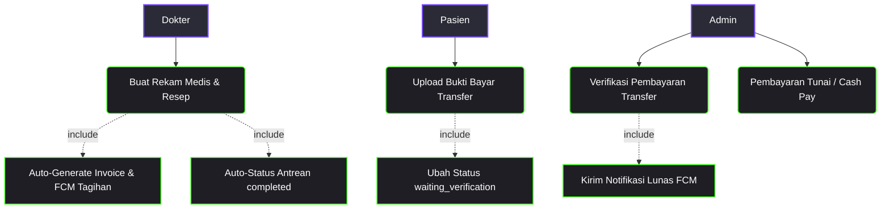
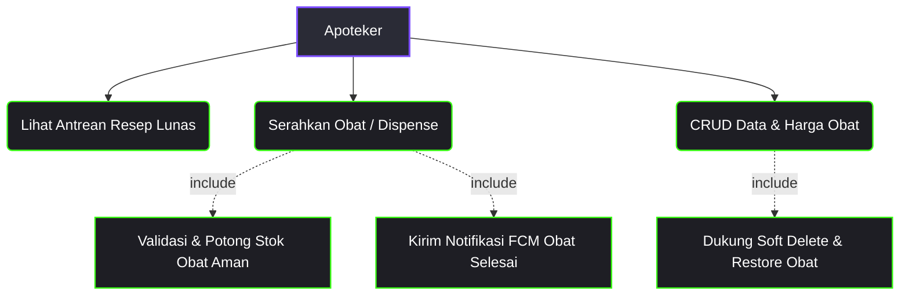
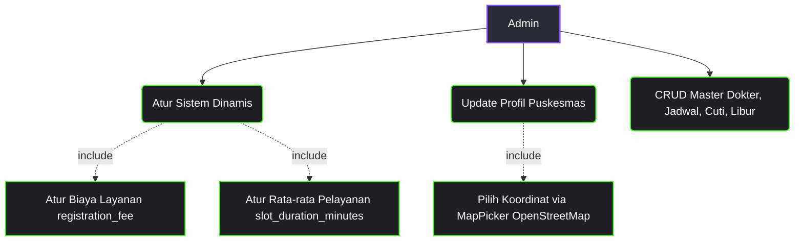

# 🗺️ Use Case Diagram NalaSeva (Flutter & Laravel REST API)

Dokumen ini menyajikan rancangan **Use Case Diagram** terperinci dan komprehensif untuk sistem **NalaSeva** (Aplikasi Manajemen Antrean & Rekam Medis Puskesmas Digital). Diagram ini memetakan interaksi aktor terhadap sistem batas (*system boundary*) yang terintegrasi antara **Flutter Mobile Client** dan **Laravel REST API Backend**.

---

## 👥 Aktor Sistem (Actors)

Sistem NalaSeva memiliki **4 Aktor Utama** dengan tingkat otorisasi berbasis *Role-Based Access Control* (RBAC) yang terdefinisi dengan ketat:

| Aktor | Deskripsi Peran | Platform Utama |
|---|---|---|
| **Pasien (Patient)** | Pengguna terdaftar puskesmas yang memesan antrean (maksimal H-7), membatalkan antrean dengan cut-off 2 jam, mengunggah bukti bayar, memantau estimasi waktu secara real-time, serta melihat rekam medis miliknya. | Flutter Mobile |
| **Dokter (Doctor)** | Tenaga medis yang memproses antrean pemeriksaan polikliniknya, mengontrol kehadiran (online/offline), dan membuat rekam medis beserta resep obat yang secara otomatis menerbitkan tagihan. | Flutter Mobile |
| **Apoteker (Pharmacist)** | Tenaga kesehatan di apotek yang melihat daftar resep obat yang pembayarannya telah lunas, menyerahkan obat (*dispensing*), serta mengelola stok dan harga obat. | Flutter Mobile |
| **Admin** | Pengelola sistem dengan akses penuh untuk mengelola master data (user, poliklinik, dokter, jadwal, libur), memproses check-in (manual/QR scanner), recall/panggil (dengan TTS), skip antrean, verifikasi bukti bayar (transfer/tunai), serta memperbarui konfigurasi dinamis. | Flutter Mobile |

---

## 📊 1. Diagram Kasus Penggunaan Utama (System Use Cases Overview)

Berikut adalah diagram besar seluruh use case pada sistem **NalaSeva** menggunakan notasi **Mermaid.js**:

```mermaid
flowchart LR
  classDef actorStyle fill:#2a2b36,stroke:#7c4dff,stroke-width:2px,color:#fff;
  classDef usecaseStyle fill:#1e1e24,stroke:#39ff14,stroke-width:1.5px,color:#fff;
  
  subgraph NalaSeva System Boundary
    %% Authentication & Profile
    UC1((Autentikasi & Akun)):::usecaseStyle
    UC2((Kelola Profil)):::usecaseStyle
    UC15((Lihat Profil Puskesmas)):::usecaseStyle
    
    %% Patient Flow
    UC3((Booking Antrean)):::usecaseStyle
    UC4((Batalkan Antrean)):::usecaseStyle
    UC5((Bayar Tagihan & Resep)):::usecaseStyle
    
    %% Doctor Flow
    UC6((Update Status Online)):::usecaseStyle
    UC7((Proses Antrean)):::usecaseStyle
    UC8((Buat Rekam Medis)):::usecaseStyle
    
    %% Pharmacist Flow
    UC9((Serahkan Obat)):::usecaseStyle
    UC10((CRUD Inventaris Obat)):::usecaseStyle
    
    %% Admin Flow
    UC11((Manajemen Fisik Antrean)):::usecaseStyle
    UC12((CRUD Master Data)):::usecaseStyle
    UC13((Verifikasi Pembayaran)):::usecaseStyle
    UC14((Atur Pengaturan Dinamis)):::usecaseStyle
  end

  %% Actors
  Pasien[Pasien]:::actorStyle
  Dokter[Dokter]:::actorStyle
  Apoteker[Apoteker]:::actorStyle
  AdminActor[Admin]:::actorStyle

  %% Relations
  Pasien --> UC1
  Pasien --> UC2
  Pasien --> UC3
  Pasien --> UC4
  Pasien --> UC5
  Pasien --> UC15

  Dokter --> UC1
  Dokter --> UC2
  Dokter --> UC6
  Dokter --> UC7
  Dokter --> UC8
  Dokter --> UC15

  Apoteker --> UC1
  Apoteker --> UC9
  Apoteker --> UC10
  Apoteker --> UC15

  AdminActor --> UC1
  AdminActor --> UC11
  AdminActor --> UC12
  AdminActor --> UC13
  AdminActor --> UC14
  AdminActor --> UC10
  AdminActor --> UC15
```



---

## 📂 2. Use Diagram Sub-Sistem Terperinci

Untuk memperjelas relasi `<<include>>`, `<<extend>>`, dan spesifikasi masing-masing aktor, use case dibagi menjadi 5 sub-sistem operasional:

### 🔑 Sub-Sistem 1: Autentikasi & Akun
Mengelola alur masuk, pendaftaran mandiri pasien, pemulihan akun via OTP email, serta mekanisme offline-restore state.

```mermaid
flowchart TD
  classDef actorStyle fill:#2a2b36,stroke:#7c4dff,stroke-width:2px,color:#fff;
  classDef usecaseStyle fill:#1e1e24,stroke:#39ff14,stroke-width:1.5px,color:#fff;

  User[Pengguna (Semua Role)]:::actorStyle --> UC_Login(Login Pengguna):::usecaseStyle
  User --> UC_OTP(Lupa Password / OTP Flow):::usecaseStyle
  Pasien[Pasien]:::actorStyle --> UC_Reg(Registrasi Akun):::usecaseStyle
  
  Pasien --> UC_Profile(Lihat & Update Profil):::usecaseStyle
  Pasien --> UC_FCM(Update FCM Token):::usecaseStyle
  Pasien --> UC_Offline(Restore Sesi Offline):::usecaseStyle

  UC_Reg -.->|include| UC_Conf[password_confirmation & role: 'patient']:::usecaseStyle
  UC_Login -.->|include| UC_SaveToken[Simpan ke Secure Storage]:::usecaseStyle
  UC_OTP -.->|include| UC_VerifyOTP[Validasi 6-Digit OTP]:::usecaseStyle
  UC_Profile -.->|extend| UC_Map[Pilih Lokasi MapPicker]:::usecaseStyle
```

### 📅 Sub-Sistem 2: Manajemen Antrean (Queue)
Mengontrol pembuatan antrean dengan 5 lapis validasi, pembatalan dengan batas toleransi, pemanggilan antrean loket, pemindaian QR code untuk check-in, dan display TV Monitor.

```mermaid
flowchart TD
  classDef actorStyle fill:#2a2b36,stroke:#7c4dff,stroke-width:2px,color:#fff;
  classDef usecaseStyle fill:#1e1e24,stroke:#39ff14,stroke-width:1.5px,color:#fff;

  Pasien[Pasien]:::actorStyle --> UC_Book(Booking Antrean):::usecaseStyle
  Pasien --> UC_Cancel(Batalkan Antrean):::usecaseStyle
  Admin[Admin]:::actorStyle --> UC_CheckIn(Check-In Antrean):::usecaseStyle
  Admin --> UC_Recall(Panggil Ulang / Recall):::usecaseStyle
  Admin --> UC_Skip(Skip Antrean ke Belakang):::usecaseStyle
  Admin --> UC_TV(Display Monitor Antrean TV):::usecaseStyle
  
  Dokter[Dokter]:::actorStyle --> UC_Status(Toggle Status Online):::usecaseStyle
  Dokter --> UC_Proc(Proses Antrean):::usecaseStyle

  UC_Book -.->|include| UC_Val5[5-Layer Validation Ketersediaan]:::usecaseStyle
  UC_Book -.->|include| UC_Priority[Auto Priority Lansia Usia >= 60]:::usecaseStyle
  
  UC_Cancel -.->|include| UC_Cutoff[Validasi Cut-off Waktu 2 Jam]:::usecaseStyle
  
  UC_CheckIn -.->|extend| UC_QR[Pindai Tiket via QR Scanner]:::usecaseStyle
  UC_CheckIn -.->|include| UC_TimeVal[ServiceTimeValidator 30 Menit - 2 Jam]:::usecaseStyle
  
  UC_Recall -.->|include| UC_TTS[Bicara Audio via Text-to-Speech]:::usecaseStyle
  UC_Recall -.->|extend| UC_RecallLimit[Kirim ke Paling Belakang jika Panggilan >= 3]:::usecaseStyle
```



### 🩺 Sub-Sistem 3: Rekam Medis & Pembayaran (Payments)
Mengatur pembuatan rekam medis dokter yang memicu pembuatan tagihan otomatis, pengunggahan bukti transfer bank oleh pasien, dan verifikasi pembayaran.



### 💊 Sub-Sistem 4: Modul Apotek (Pharmacy)
Mengelola penyerahan obat resep lunas kepada pasien serta manajemen inventaris stok obat.



### ⚙️ Sub-Sistem 5: Konfigurasi & Pengaturan Dinamis
Memungkinkan Admin mengonfigurasi profil puskesmas, memilih letak koordinat pada OpenStreetMap, dan menyetel konfigurasi biaya pendaftaran puskesmas.



---

## 🔌 3. Pemetaan Teknis: Flutter UI & Laravel REST API Endpoints

Tabel berikut menunjukkan integrasi pemetaan use case di sisi Flutter Client (Screen / Provider) dengan API Endpoint Laravel REST API Backend yang tepat:

| Nama Use Case | Fitur Flutter (`Provider` / `Screen`) | Endpoint REST API (Laravel) |
|---|---|---|
| **Registrasi Pasien** | [AuthProvider](file:///d:/Materi%20Semester%204/PBM/nalaseva%203/lib/features/auth/logic/auth_provider.dart) / [register_screen.dart](file:///d:/Materi%20Semester%204/PBM/nalaseva%203/lib/features/auth/ui/register_screen.dart) | `POST /api/auth/register` *(mengirim password_confirmation & role: 'patient')* |
| **Login Pengguna** | [AuthProvider](file:///d:/Materi%20Semester%204/PBM/nalaseva%203/lib/features/auth/logic/auth_provider.dart) / [login_screen.dart](file:///d:/Materi%20Semester%204/PBM/nalaseva%203/lib/features/auth/ui/login_screen.dart) | `POST /api/auth/login` |
| **Lupa Password (OTP)** | [AuthProvider](file:///d:/Materi%20Semester%204/PBM/nalaseva%203/lib/features/auth/logic/auth_provider.dart) / [forgot_password_screen.dart](file:///d:/Materi%20Semester%204/PBM/nalaseva%203/lib/features/auth/ui/forgot_password_screen.dart) | `POST /api/auth/forgot-password/otp` *(Request OTP)*<br>`POST /api/auth/forgot-password` *(Reset Password)* |
| **Lihat Profil Akun** | [AuthProvider](file:///d:/Materi%20Semester%204/PBM/nalaseva%203/lib/features/auth/logic/auth_provider.dart) / [profile_screen.dart](file:///d:/Materi%20Semester%204/PBM/nalaseva%203/lib/features/patient/ui/profile_screen.dart) | `GET /api/auth/profile` |
| **Update Profil Akun** | [AuthProvider](file:///d:/Materi%20Semester%204/PBM/nalaseva%203/lib/features/auth/logic/auth_provider.dart) / [edit_profile_screen.dart](file:///d:/Materi%20Semester%204/PBM/nalaseva%203/lib/features/patient/ui/edit_profile_screen.dart) | `POST /api/auth/update-profile` *(Multipart POST bukan PUT)* |
| **Booking Antrean** | [PatientProvider](file:///d:/Materi%20Semester%204/PBM/nalaseva%203/lib/features/patient/logic/patient_provider.dart) / [booking_screen.dart](file:///d:/Materi%20Semester%204/PBM/nalaseva%203/lib/features/patient/ui/booking_screen.dart) | `POST /api/queues` *(Throttling 5 req/menit)* |
| **Batalkan Antrean** | [PatientProvider](file:///d:/Materi%20Semester%204/PBM/nalaseva%203/lib/features/patient/logic/patient_provider.dart) / [booking_detail_screen.dart](file:///d:/Materi%20Semester%204/PBM/nalaseva%203/lib/features/patient/ui/booking_detail_screen.dart) | `DELETE /api/queues/{id}` |
| **Toggle Status Online**| [DoctorProvider](file:///d:/Materi%20Semester%204/PBM/nalaseva%203/lib/features/doctor/logic/doctor_provider.dart) / [doctor_dashboard.dart](file:///d:/Materi%20Semester%204/PBM/nalaseva%203/lib/features/doctor/ui/doctor_dashboard.dart) | `PATCH /api/doctors/me/status` |
| **Proses Antrean Dokter**| [DoctorProvider](file:///d:/Materi%20Semester%204/PBM/nalaseva%203/lib/features/doctor/logic/doctor_provider.dart) / [doctor_dashboard.dart](file:///d:/Materi%20Semester%204/PBM/nalaseva%203/lib/features/doctor/ui/doctor_dashboard.dart) | `PUT /api/queues/{id}` |
| **Buat Rekam Medis** | [DoctorProvider](file:///d:/Materi%20Semester%204/PBM/nalaseva%203/lib/features/doctor/logic/doctor_provider.dart) / [examination_form_screen.dart](file:///d:/Materi%20Semester%204/PBM/nalaseva%203/lib/features/doctor/ui/examination_form_screen.dart) | `POST /api/examinations` |
| **Lihat Riwayat Medis** | [PatientProvider](file:///d:/Materi%20Semester%204/PBM/nalaseva%203/lib/features/patient/logic/patient_provider.dart) / [patient_history_screen.dart](file:///d:/Materi%20Semester%204/PBM/nalaseva%203/lib/features/patient/ui/patient_history_screen.dart) | `GET /api/examinations` |
| **Lihat Tagihan & Invoice**| [PaymentProvider](file:///d:/Materi%20Semester%204/PBM/nalaseva%203/lib/features/payment/logic/payment_provider.dart) / [payment_list_screen.dart](file:///d:/Materi%20Semester%204/PBM/nalaseva%203/lib/features/payment/ui/payment_list_screen.dart) | `GET /api/payments` |
| **Upload Bukti Bayar** | [PaymentProvider](file:///d:/Materi%20Semester%204/PBM/nalaseva%203/lib/features/payment/logic/payment_provider.dart) / [payment_detail_screen.dart](file:///d:/Materi%20Semester%204/PBM/nalaseva%203/lib/features/payment/ui/payment_detail_screen.dart) | `POST /api/payments/{id}/upload-proof` *(Throttling 5 req/menit)* |
| **Check-In Loket Fisik**| [AdminProvider](file:///d:/Materi%20Semester%204/PBM/nalaseva%203/lib/features/admin/logic/admin_provider.dart) / [queue_management_screen.dart](file:///d:/Materi%20Semester%204/PBM/nalaseva%203/lib/features/admin/ui/queue_management_screen.dart) | `POST /api/queues/{id}/checkin` |
| **Check-In QR Tiket** | [AdminProvider](file:///d:/Materi%20Semester%204/PBM/nalaseva%203/lib/features/admin/logic/admin_provider.dart) / [qr_scanner_page.dart](file:///d:/Materi%20Semester%204/PBM/nalaseva%203/lib/features/admin/widgets/qr_scanner_page.dart) | `POST /api/queues/{id}/checkin` *(Pindai Format QR)* |
| **Recall / Panggil Pasien**| [AdminProvider](file:///d:/Materi%20Semester%204/PBM/nalaseva%203/lib/features/admin/logic/admin_provider.dart) / [queue_management_screen.dart](file:///d:/Materi%20Semester%204/PBM/nalaseva%203/lib/features/admin/ui/queue_management_screen.dart) | `POST /api/queues/{id}/recall` *(Integrasi audio TTS)* |
| **Skip / Geser Antrean** | [AdminProvider](file:///d:/Materi%20Semester%204/PBM/nalaseva%203/lib/features/admin/logic/admin_provider.dart) / [queue_management_screen.dart](file:///d:/Materi%20Semester%204/PBM/nalaseva%203/lib/features/admin/ui/queue_management_screen.dart) | `POST /api/queues/{id}/skip` |
| **Verifikasi Bukti Bayar**| [PaymentProvider](file:///d:/Materi%20Semester%204/PBM/nalaseva%203/lib/features/payment/logic/payment_provider.dart) / [payment_detail_screen.dart](file:///d:/Materi%20Semester%204/PBM/nalaseva%203/lib/features/payment/ui/payment_detail_screen.dart) | `POST /api/payments/{id}/verify` |
| **Pembayaran Tunai (Cash)**| [PaymentProvider](file:///d:/Materi%20Semester%204/PBM/nalaseva%203/lib/features/payment/logic/payment_provider.dart) / [payment_detail_screen.dart](file:///d:/Materi%20Semester%204/PBM/nalaseva%203/lib/features/payment/ui/payment_detail_screen.dart) | `POST /api/payments/{id}/cash-pay` |
| **Serahkan Obat** | [PharmacyProvider](file:///d:/Materi%20Semester%204/PBM/nalaseva%203/lib/features/pharmacy/logic/pharmacy_provider.dart) / [prescription_detail_screen.dart](file:///d:/Materi%20Semester%204/PBM/nalaseva%203/lib/features/pharmacy/ui/prescription_detail_screen.dart) | `POST /api/pharmacy/queues/{id}/dispense` |
| **Membaca Profil Puskesmas**| [PuskesmasProfileProvider](file:///d:/Materi%20Semester%204/PBM/nalaseva%203/lib/shared/providers/puskesmas_profile_provider.dart) / [patient_dashboard.dart](file:///d:/Materi%20Semester%204/PBM/nalaseva%203/lib/features/patient/ui/patient_dashboard.dart) | `GET /api/puskesmas-profile` *(Diakses setelah otentikasi)* |
| **Perbarui Profil Puskesmas**| [PuskesmasProfileProvider](file:///d:/Materi%20Semester%204/PBM/nalaseva%203/lib/shared/providers/puskesmas_profile_provider.dart) / [admin_settings_screen.dart](file:///d:/Materi%20Semester%204/PBM/nalaseva%203/lib/features/admin/ui/admin_settings_screen.dart) | `PUT /api/puskesmas-profile` *(MapPicker koordinat OSM)* |
| **Pengaturan Sistem** | [AdminProvider](file:///d:/Materi%20Semester%204/PBM/nalaseva%203/lib/features/admin/logic/admin_provider.dart) / [admin_settings_screen.dart](file:///d:/Materi%20Semester%204/PBM/nalaseva%203/lib/features/admin/ui/admin_settings_screen.dart) | `GET /api/settings`<br>`PUT /api/settings` |

---

## 🔒 4. Logika Validasi Use Case (Business Rules)

Untuk menjamin keamanan dan integritas penggunaan sistem, setiap *trigger* use case diatur oleh logika bisnis pada *service layer* API:

1. **Aturan Booking Keras (5-Layer Validation)**:
   - Tanggal pendaftaran dibatasi dari hari H hingga maksimal H+7.
   - Pendaftaran hari ini wajib dilakukan sebelum jam praktik dimulai.
   - Validasi puskesmas tidak sedang dalam kondisi libur (`ClinicHoliday`).
   - Validasi dokter yang bersangkutan tidak dalam status cuti (`DoctorLeave`).
   - Sistem menolak booking duplikat pada poliklinik yang sama di hari yang sama.
   - Sistem melarang antrean dengan irisan jam pelayanan yang tumpang tindih (*overlap*) antar-poliklinik untuk satu pasien.

2. **Aturan Pembatalan Pasien (Cut-Off 2 Jam)**:
   - Pasien diizinkan membatalkan antrean tanpa penalti jika tiket dibuat dalam waktu kurang dari 15 menit terakhir.
   - Di luar durasi tersebut, pembatalan hanya boleh dilakukan maksimal **2 jam** sebelum estimasi pelayanan dokter dimulai.

3. **Pemberian Hak Check-In (Absensi)**:
   - Status antrean harus berstatus `booked` dan hanya bisa di-check-in pada hari kunjungan yang bersangkutan.
   - Mengikuti validasi batas jendela waktu check-in: minimal **30 menit sebelum** dan maksimal **2 jam sesudah** waktu estimasi pelayanan (`estimated_service_time`).

4. **Sistem Antrean Prioritas Usia (Elderly Flag)**:
   - Saat booking dilakukan, sistem secara otomatis mengekstrak selisih tahun lahir pasien. Pasien berumur $\ge 60$ tahun otomatis diidentifikasi sebagai antrean prioritas.
   - Antrean prioritas ditempatkan di urutan terdepan pada antrean berjalan, hanya kalah dari antrean prioritas yang datang lebih awal dan antrean yang sedang diperiksa (`examining`).

5. **Transaksi Stok Apotek Aman**:
   - Proses serah obat di apotek berjalan di dalam `DB::beginTransaction()`.
   - Validasi ketat membandingkan kuantitas resep dengan stok fisik obat. Jika terdapat satu obat yang stoknya tidak memadai, seluruh transaksi penyerahan digagalkan demi menghindari inkonsistensi persediaan.

---

*Dokumen ini merupakan panduan Use Case resmi sistem NalaSeva.*  
*Diperbarui: 3 Juni 2026 — Sesuai dengan Sistem Produksi Flutter (`nalaseva 3`)*
