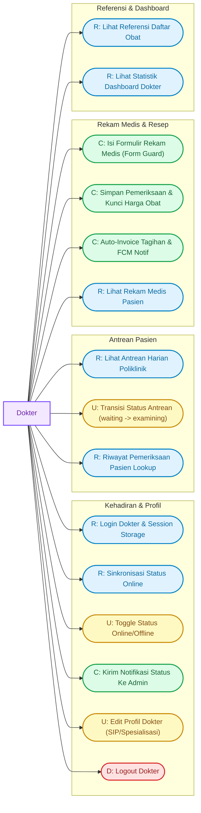
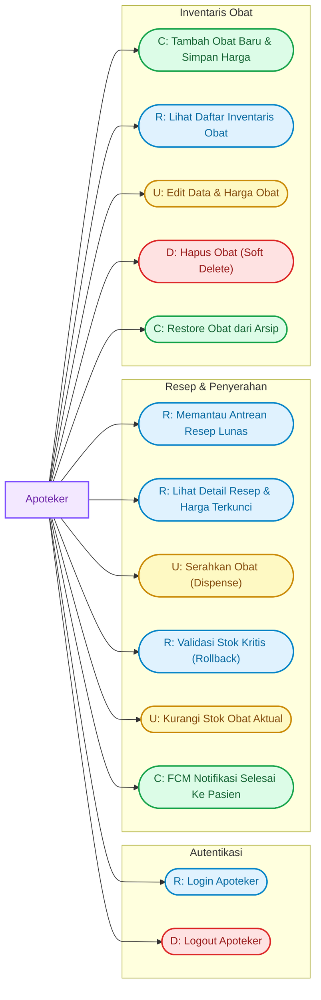

# 🗺️ Use Case Diagram NalaSeva — Fokus CRUD per Aktor (Sangat Detail)

Dokumen ini menyajikan **Use Case Diagram berbasis operasi CRUD** (Create, Read, Update, Delete) yang sangat mendalam untuk sistem **NalaSeva** (Aplikasi Manajemen Antrean & Rekam Medis Puskesmas Digital). Setiap use case dipetakan langsung secara rinci dari fungsionalitas dan logika bisnis yang tercantum dalam [FITUR_PER_AKTOR.md](file:///d:/Materi%20Semester%204/PBM/nalaseva%203/dokumentasi/FITUR_PER_AKTOR.md).

---

## 👥 Aktor Sistem

| Aktor | Deskripsi |
|---|---|
| **Pasien** | Pengguna akhir — melakukan registrasi mandiri, booking antrean, kelola profil, mengunggah bukti bayar, memantau estimasi antrean, dan melihat riwayat medis pribadinya. |
| **Dokter** | Tenaga medis — mengelola status kehadiran (online/offline), memeriksa pasien, mencatat rekam medis serta menginput resep obat secara terstruktur. |
| **Apoteker** | Tenaga apotek — memantau resep lunas, menyerahkan obat (dispense) dengan pemotongan stok otomatis, serta mengelola inventaris obat puskesmas. |
| **Admin** | Pengelola sistem — mengelola seluruh data master (dokter, jadwal, cuti, libur, poliklinik, user, pasien), menangani loket pendaftaran/check-in/panggilan, memverifikasi pembayaran, serta mengonfigurasi pengaturan sistem dan profil puskesmas. |

---

## 📊 1. Diagram Utama — CRUD Use Cases per Aktor

```mermaid
flowchart LR
  classDef actorStyle fill:#f3e8ff,stroke:#7c4dff,stroke-width:2px,color:#6b21a8;
  classDef usecaseStyle fill:#e0f2fe,stroke:#0284c7,stroke-width:2px,color:#0369a1;

  subgraph NalaSeva ["Sistem NalaSeva (CRUD)"]

    subgraph Modul_Auth ["Akun & Profil"]
      UC1(("Registrasi Akun Mandiri")):::usecaseStyle
      UC2(("Login & Sinkronisasi Token FCM")):::usecaseStyle
      UC3(("Pemulihan Sesi (Session Restore)")):::usecaseStyle
      UC4(("Lihat & Edit Profil")):::usecaseStyle
      UC5(("Lupa Password OTP & Reset")):::usecaseStyle
      UC6(("Logout")):::usecaseStyle
    end

    subgraph Modul_Antrean ["Manajemen Antrean"]
      UC7(("Booking Antrean Mandiri")):::usecaseStyle
      UC8(("Booking Antrean Walk-In")):::usecaseStyle
      UC9(("Lihat & Monitoring Antrean")):::usecaseStyle
      UC10(("Check-In (Loket / QR Scanner)")):::usecaseStyle
      UC11(("Recall (Panggil & TTS)")):::usecaseStyle
      UC12(("Skip Antrean")):::usecaseStyle
      UC13(("Batalkan Antrean (Cut-Off)")):::usecaseStyle
      UC14(("Update Status Antrean (Override)")):::usecaseStyle
    end

    subgraph Modul_Medis ["Rekam Medis"]
      UC15(("Buat Rekam Medis & Resep")):::usecaseStyle
      UC16(("Lihat Riwayat Pemeriksaan")):::usecaseStyle
    end

    subgraph Modul_Tagihan ["Tagihan & Pembayaran"]
      UC19(("Lihat Tagihan & Rincian")):::usecaseStyle
      UC20(("Upload Bukti Bayar")):::usecaseStyle
      UC21(("Verifikasi Bukti Transfer")):::usecaseStyle
      UC22(("Proses Bayar Tunai")):::usecaseStyle
    end

    subgraph Modul_Obat ["Inventaris Obat"]
      UC23(("Tambah Obat Baru")):::usecaseStyle
      UC24(("Lihat Daftar Obat")):::usecaseStyle
      UC25(("Edit Data & Harga Obat")):::usecaseStyle
      UC26(("Hapus Obat (Soft Delete)")):::usecaseStyle
      UC27(("Restore Obat dari Arsip")):::usecaseStyle
      UC28(("Serahkan Obat (Dispense)")):::usecaseStyle
    end

    subgraph Modul_Master ["Data Master (Admin)"]
      UC29(("CRUD Dokter & Restore")):::usecaseStyle
      UC30(("CRUD Jadwal Praktik")):::usecaseStyle
      UC31(("CRUD Cuti Dokter")):::usecaseStyle
      UC32(("CRUD Hari Libur")):::usecaseStyle
      UC33(("CRUD Poliklinik")):::usecaseStyle
      UC34(("CRUD User")):::usecaseStyle
      UC35(("CRUD Pasien")):::usecaseStyle
    end

    subgraph Modul_Pengaturan ["Pengaturan & Pendukung"]
      UC36(("Lihat & Edit Pengaturan")):::usecaseStyle
      UC37(("Update Profil Puskesmas & Peta")):::usecaseStyle
      UC38(("TV Monitor (TTS & Responsive)")):::usecaseStyle
      UC39(("Monitoring Koneksi Internet")):::usecaseStyle
      UC40(("Toggle Online & Notifikasi Dokter")):::usecaseStyle
      UC41(("Session Timeout (Auto Logout 15 Menit)")):::usecaseStyle
    end

  end

  %% Actors
  Pasien[Pasien]:::actorStyle
  Dokter[Dokter]:::actorStyle
  Apoteker[Apoteker]:::actorStyle
  AdminActor[Admin]:::actorStyle

  %% Pasien
  Pasien --> UC1
  Pasien --> UC2
  Pasien --> UC3
  Pasien --> UC4
  Pasien --> UC5
  Pasien --> UC6
  Pasien --> UC7
  Pasien --> UC9
  Pasien --> UC13
  Pasien --> UC16
  Pasien --> UC19
  Pasien --> UC20
  Pasien --> UC39
  Pasien --> UC41

  %% Dokter
  Dokter --> UC2
  Dokter --> UC3
  Dokter --> UC4
  Dokter --> UC6
  Dokter --> UC9
  Dokter --> UC14
  Dokter --> UC15
  Dokter --> UC16
  Dokter --> UC24
  Dokter --> UC40

  %% Apoteker
  Apoteker --> UC2
  Apoteker --> UC6
  Apoteker --> UC9
  Apoteker --> UC23
  Apoteker --> UC24
  Apoteker --> UC25
  Apoteker --> UC26
  Apoteker --> UC27
  Apoteker --> UC28

  %% Admin
  AdminActor --> UC2
  AdminActor --> UC4
  AdminActor --> UC6
  AdminActor --> UC8
  AdminActor --> UC9
  AdminActor --> UC10
  AdminActor --> UC11
  AdminActor --> UC12
  AdminActor --> UC13
  AdminActor --> UC14
  AdminActor --> UC16
  AdminActor --> UC19
  AdminActor --> UC21
  AdminActor --> UC22
  AdminActor --> UC23
  AdminActor --> UC24
  AdminActor --> UC25
  AdminActor --> UC26
  AdminActor --> UC27
  AdminActor --> UC28
  AdminActor --> UC29
  AdminActor --> UC30
  AdminActor --> UC31
  AdminActor --> UC32
  AdminActor --> UC33
  AdminActor --> UC34
  AdminActor --> UC35
  AdminActor --> UC36
  AdminActor --> UC37
  AdminActor --> UC38
  AdminActor --> UC41
```

---

## 📂 2. Sub-Sistem CRUD Terperinci per Aktor

### 👤 Sub-Sistem 1: Pasien — CRUD Akun, Antrean, Tagihan & Pendukung

Diagram di bawah menggambarkan use case detail yang dapat diakses oleh Aktor Pasien secara mandiri.

```mermaid
flowchart LR
  classDef actorStyle fill:#f3e8ff,stroke:#7c4dff,stroke-width:2px,color:#6b21a8;
  classDef cStyle fill:#dcfce7,stroke:#16a34a,stroke-width:2px,color:#166534;
  classDef rStyle fill:#e0f2fe,stroke:#0284c7,stroke-width:2px,color:#0369a1;
  classDef uStyle fill:#fef9c3,stroke:#ca8a04,stroke-width:2px,color:#854d0e;
  classDef dStyle fill:#fee2e2,stroke:#dc2626,stroke-width:2px,color:#991b1b;

  Pasien[Pasien]:::actorStyle

  subgraph Akun ["Akun & Profil"]
    C1(["C: Registrasi Mandiri (10 Kolom)"]):::cStyle
    R1(["R: Login & FCM Token Sync"]):::rStyle
    R2(["R: Pemulihan Sesi (Offline Mode)"]):::rStyle
    U1(["U: Lupa Password (OTP 6-Digit Flow)"]):::uStyle
    U2(["U: Edit Profil & Kunci NIK"]):::uStyle
    D1(["D: Logout Akun"]):::dStyle
  end

  subgraph Antrean ["Antrean"]
    C2(["C: Booking Mandiri (Maks H-7)"]):::cStyle
    R3(["R: Cek Libur & Cuti Dokter"]):::rStyle
    R4(["R: Validasi 5-Layer & Kuota"]):::rStyle
    R5(["R: Lihat Antrean & QR Code Tiket"]):::rStyle
    R6(["R: Estimasi Waktu Tunggu (Adaptive)"]):::rStyle
    D2(["D: Batalkan Antrean (Cut-off Rule)"]):::dStyle
  end

  subgraph Tagihan ["Tagihan"]
    R7(["R: Lihat Daftar & Detail Tagihan"]):::rStyle
    U3(["U: Upload Bukti Transfer (Image Picker)"]):::uStyle
  end

  subgraph RekamMedis ["Rekam Medis"]
    R8(["R: Lihat Riwayat Pemeriksaan (Filter Bulan)"]):::rStyle
    R9(["R: Lihat Detail Rekam Medis (Resep)"]):::rStyle
  end

  subgraph NotifPeta ["Notifikasi & Pendukung"]
    R10(["R: Lihat Kotak Masuk FCM"]):::rStyle
    R11(["R: Lihat Profil Puskesmas & Peta"]):::rStyle
    R12(["R: Monitor Koneksi Internet"]):::rStyle
    D_ST(["D: Session Timeout — Auto Logout (15 Menit)"]):::dStyle
  end

  Pasien --> C1
  Pasien --> R1
  Pasien --> R2
  Pasien --> U1
  Pasien --> U2
  Pasien --> D1
  Pasien --> C2
  Pasien --> R3
  Pasien --> R4
  Pasien --> R5
  Pasien --> R6
  Pasien --> D2
  Pasien --> R7
  Pasien --> U3
  Pasien --> R8
  Pasien --> R9
  Pasien --> R10
  Pasien --> R11
  Pasien --> R12
  Pasien --> D_ST
```

#### 📝 Deskripsi Detail Use Case Pasien:

*   **C1: Registrasi Mandiri (10 Kolom)**
    *   *Deskripsi*: Pasien mendaftar akun baru dengan mengisi form data diri (Nama, Email, Password, Konfirmasi Password, NIK 16-digit, No Telepon, Jenis Kelamin, Tanggal Lahir, Alamat).
    *   *Logika Bisnis*: Backend memproses via **DB Transaction** untuk menyimpan record di tabel `users` (sebagai `patient`) dan `patients` sekaligus. NIK dan Email divalidasi unik.
    *   *API*: `POST /api/auth/register`
*   **R1: Login & FCM Token Sync**
    *   *Deskripsi*: Memasukkan email dan password untuk masuk ke aplikasi. Token FCM perangkat disinkronkan ke backend untuk notifikasi.
    *   *Logika Bisnis*: Token Bearer disimpan terenkripsi di `FlutterSecureStorage`. ID Pasien dan Role di-cache secara lokal.
    *   *API*: `POST /api/auth/login`, `POST /api/auth/fcm-token`
*   **R2: Pemulihan Sesi (Offline Mode)**
    *   *Deskripsi*: Memulihkan sesi saat aplikasi dibuka ulang.
    *   *Logika Bisnis*: Jika koneksi gagal, sistem menggunakan **Sentinel UserModel Offline** untuk mengizinkan pasien melihat data ter-cache secara offline.
    *   *API*: `GET /api/auth/profile`
*   **U1: Lupa Password (OTP 6-Digit Flow)**
    *   *Deskripsi*: Pengguna mereset password menggunakan verifikasi OTP 6 digit.
    *   *Logika Bisnis*: Mengisi Email + NIK untuk mendapat OTP (berlaku 15 menit), lalu reset password dan secara otomatis **force logout** dari seluruh perangkat.
    *   *API*: `POST /api/auth/forgot-password/otp`, `POST /api/auth/forgot-password`
*   **U2: Edit Profil & Kunci NIK**
    *   *Deskripsi*: Memperbarui data profil diri sendiri.
    *   *Logika Bisnis*: NIK hanya dapat diisi atau diedit apabila sebelumnya masih kosong. Setelah terisi, NIK terkunci permanen demi keamanan identitas.
    *   *API*: `POST /api/auth/update-profile`
*   **D1: Logout Akun**
    *   *Deskripsi*: Keluar dari sistem dan menghapus sesi token aktif saat ini.
    *   *API*: `POST /api/auth/logout`
*   **C2: Booking Mandiri (Maks H-7)**
    *   *Deskripsi*: Melakukan pendaftaran nomor antrean poliklinik secara mandiri untuk hari ini hingga H-7.
    *   *Logika Bisnis*: Dilindungi **throttle limit** maks 5 request per menit dan **Anti-IDOR Check** (hanya bisa mendaftarkan diri sendiri).
    *   *API*: `POST /api/queues`
*   **R3: Cek Libur & Cuti Dokter**
    *   *Deskripsi*: Mengambil data tanggal libur klinik dan cuti dokter yang dipilih untuk kemudian di-disable pada kalender date picker.
    *   *API*: `GET /api/clinic-holidays`, `GET /api/doctor-leaves`
*   **R4: Validasi 5-Layer & Kuota**
    *   *Deskripsi*: Backend memeriksa kelayakan booking antrean berdasarkan 5 lapis validasi: Hari Libur Klinik, Cuti Dokter, Konsistensi Jadwal, Duplikat Poli per Hari, dan Jam Layanan Overlap.
    *   *API*: `GET /api/doctor-schedules`
*   **R5: Lihat Antrean & QR Code Tiket**
    *   *Deskripsi*: Melihat detail tiket antrean aktif lengkap dengan QR Code berisi payload `NALASEVA_QUEUE_{id}`.
    *   *API*: `GET /api/queues`
*   **R6: Estimasi Waktu Tunggu (Adaptive)**
    *   *Deskripsi*: Menghitung waktu tunggu pelayanan secara adaptif berdasarkan rata-rata durasi 3 rekam medis terakhir yang selesai hari ini.
*   **D2: Batalkan Antrean (Cut-off Rule)**
    *   *Deskripsi*: Membatalkan antrean terdaftar milik sendiri.
    *   *Logika Bisnis*: Diizinkan jika dibuat ≤ 15 menit lalu, ATAU > 2 jam sebelum waktu estimasi pelayanan.
    *   *API*: `DELETE /api/queues/{id}`
*   **R7: Lihat Daftar & Detail Tagihan**
    *   *Deskripsi*: Melihat daftar dan detail biaya invoice (`NS-PAY-YYYYMMDD-XXXXXX`) yang berisi biaya registrasi dan biaya obat (harga obat dikunci saat resep terbit).
    *   *API*: `GET /api/payments`
*   **U3: Upload Bukti Transfer (Image Picker)**
    *   *Deskripsi*: Mengunggah foto bukti bayar dari galeri atau kamera HP (dilindungi throttle maks 5/menit).
    *   *API*: `POST /api/payments/{id}/upload-proof`
*   **R8: Lihat Riwayat Pemeriksaan (Filter Bulan)**
    *   *Deskripsi*: Melihat daftar riwayat rekam medis pribadi, terlindungi dari IDOR, dan dapat dicari per bulan.
    *   *API*: `GET /api/examinations`
*   **R9: Lihat Detail Rekam Medis (Resep)**
    *   *Deskripsi*: Melihat data diagnosa, tindakan, serta detail resep obat terstruktur.
    *   *API*: `GET /api/examinations/{id}`
*   **R10: Lihat Kotak Masuk FCM**
    *   *Deskripsi*: Menampilkan riwayat notifikasi push yang diterima.
*   **R11: Lihat Profil Puskesmas & Peta**
    *   *Deskripsi*: Melihat profil puskesmas beserta koordinat peta lokasi.
    *   *API*: `GET /api/puskesmas-profile`
*   **R12: Monitor Koneksi Internet**
    *   *Deskripsi*: Memantau kondisi jaringan internet secara real-time melalui Connectivity Banner.
*   **D_ST: Session Timeout — Auto Logout (15 Menit — Pasien Only)**
    *   *Deskripsi*: Jika pengguna dengan **role pasien** tidak berinteraksi dengan layar selama **15 menit**, sistem secara otomatis memanggil `logout()`, menghapus token, dan meredirect ke halaman Login.
    *   *Logika Bisnis*: Widget `SessionTimeoutListener` membungkus `MaterialApp` via `builder` secara global, tetapi logika inaktivitas dan timer hanya aktif untuk pengguna dengan role `patient`. Timer di-reset setiap sentuhan layar (`onPointerDown`/`onPointerSignal`). Menampilkan SnackBar peringatan *"Sesi Telah Berakhir"* saat timeout terjadi.
    *   *Berbeda dari*: Error interceptor 401 (`ApiClient`) yang berbasis respons server — ini berbasis **inaktivitas waktu** di sisi client.

---

### 🩺 Sub-Sistem 2: Dokter — CRUD Rekam Medis, Resep & Kehadiran

Diagram di bawah menggambarkan use case detail yang dapat diakses oleh Aktor Dokter.

#### 📝 Deskripsi Detail Use Case Dokter:

*   **R0: Login Dokter & Session Storage**
    *   *Deskripsi*: Login khusus akun dokter yang didaftarkan oleh admin. Token Bearer disimpan di secure storage.
    *   *API*: `POST /api/auth/login`
*   **R1: Sinkronisasi Status Online**
    *   *Deskripsi*: Mengambil status online/offline dokter dari profil user saat masuk ke dashboard.
    *   *API*: `GET /api/auth/profile`
*   **U0: Toggle Status Online/Offline**
    *   *Deskripsi*: Switch keaktifan praktik dokter di ruang periksa.
    *   *API*: `PATCH /api/doctors/me/status`
*   **C0: Kirim Notifikasi Status Ke Admin**
    *   *Deskripsi*: Saat dokter mengubah status menjadi Offline, sistem otomatis memicu pengiriman notifikasi FCM ke semua akun Admin yang terdaftar.
*   **U1: Edit Profil Dokter (SIP/Spesialisasi)**
    *   *Deskripsi*: Mengubah informasi data personal dokter.
    *   *API*: `POST /api/auth/update-profile`
*   **D0: Logout Dokter**
    *   *Deskripsi*: Keluar dari akun dokter dan menghapus session token lokal.
    *   *API*: `POST /api/auth/logout`
*   **R2: Lihat Antrean Harian Poliklinik**
    *   *Deskripsi*: Menampilkan antrean pasien khusus di poliklinik tugasnya pada hari berjalan.
    *   *API*: `GET /api/queues` (filter `doctor_id`)
*   **U2: Transisi Status Antrean (waiting -> examining)**
    *   *Deskripsi*: Mengubah status antrean pasien saat dipanggil masuk ke ruang dokter.
    *   *Logika Bisnis*: Dokter harus online, tidak boleh ada pasien lain yang masih bertipe `examining` di poli yang sama. Sistem otomatis mencatat `called_time = now()` dan memicu push notifikasi FCM "Giliran Anda!" ke HP pasien. Dokter dilarang mengubah status menjadi `cancelled`.
    *   *API*: `PUT /api/queues/{id}`
*   **R3: Riwayat Pemeriksaan Pasien Lookup**
    *   *Deskripsi*: Melihat riwayat rekam medis lama milik pasien yang sedang diperiksa (khusus poliklinik terkait).
    *   *API*: `GET /api/examinations?patient_user_id={id}`
*   **C1: Isi Formulir Rekam Medis (Form Guard)**
    *   *Deskripsi*: Menginput keluhan utama, diagnosa, tindakan, dan resep obat terstruktur.
    *   *Logika Bisnis*: Jika dokter menekan tombol kembali saat form telah terisi sebagian, sistem menampilkan dialog konfirmasi Form Guard.
*   **C2: Simpan Pemeriksaan & Kunci Harga Obat**
    *   *Deskripsi*: Menyimpan data hasil pemeriksaan dan resep pasien.
    *   *Logika Bisnis*: Menggunakan **DB Transaction** atomik. Harga satuan obat dikunci saat ini agar tidak terpengaruh jika admin mengubah harga obat di masa depan.
    *   *API*: `POST /api/examinations`
*   **C3: Auto-Invoice Tagihan & FCM Notif**
    *   *Deskripsi*: Otomatis menerbitkan invoice tagihan berstatus `pending` (`NS-PAY-YYYYMMDD-XXXXXX`) setelah pemeriksaan selesai, merubah antrean menjadi `completed`, serta mengirim notifikasi tagihan ke pasien.
    *   *API*: Dipicu otomatis oleh `POST /api/examinations`
*   **R4: Lihat Rekam Medis Pasien**
    *   *Deskripsi*: Melihat daftar rekam medis yang telah dibuat.
    *   *API*: `GET /api/examinations`
*   **R5: Lihat Referensi Daftar Obat**
    *   *Deskripsi*: Menampilkan obat aktif di puskesmas untuk diinput dalam resep.
    *   *API*: `GET /api/medicines`
*   **R6: Lihat Statistik Dashboard Dokter**
    *   *Deskripsi*: Melihat ringkasan data statistik jumlah antrean aktif dan selesai milik polikliniknya.
    *   *API*: `GET /api/dashboard-stats`

---

### 💊 Sub-Sistem 3: Apoteker — CRUD Inventaris Obat & Penyerahan Resep

Diagram di bawah menggambarkan use case detail yang dapat diakses oleh Aktor Apoteker.

#### 📝 Deskripsi Detail Use Case Apoteker:

*   **R0: Login Apoteker**
    *   *Deskripsi*: Masuk menggunakan kredensial akun apoteker.
    *   *API*: `POST /api/auth/login`
*   **D0: Logout Apoteker**
    *   *Deskripsi*: Keluar dari aplikasi dan menghapus sesi token.
    *   *API*: `POST /api/auth/logout`
*   **R1: Memantau Antrean Resep Lunas**
    *   *Deskripsi*: Menampilkan resep obat pasien yang tagihannya lunas (`paid`) dan obatnya belum diserahkan (`dispensed_at IS NULL`).
    *   *API*: `GET /api/pharmacy/queues`
*   **R2: Lihat Detail Resep & Harga Terkunci**
    *   *Deskripsi*: Menampilkan rincian obat, kuantiti, dan cara pakai resep.
*   **U1: Serahkan Obat (Dispense)**
    *   *Deskripsi*: Memproses penyerahan obat fisik ke pasien.
    *   *Logika Bisnis*: Menggunakan **DB Transaction**. Sisi Flutter melakukan optimistic update dengan menghapus item dari list lokal secara instan.
    *   *API*: `POST /api/pharmacy/queues/{id}/dispense`
*   **R3: Validasi Stok Kritis (Rollback)**
    *   *Deskripsi*: Validasi ketersediaan stok obat aktual di database sebelum penyerahan.
    *   *Logika Bisnis*: Jika ada satu obat saja yang stoknya kurang dari kebutuhan resep, sistem memicu rollback seluruh transaksi dan menampilkan pesan error peringatan.
*   **U2: Kurangi Stok Obat Aktual**
    *   *Deskripsi*: Memotong jumlah stok obat di tabel `medicines` sesuai dengan kuantiti resep.
*   **C1: FCM Notifikasi Selesai Ke Pasien**
    *   *Deskripsi*: Sistem mengirimkan push notifikasi ke pasien setelah obat diserahkan: *"Obat Selesai Diserahkan. Terima kasih atas kunjungan Anda!"*.
*   **C2: Tambah Obat Baru & Simpan Harga**
    *   *Deskripsi*: Menambahkan item obat baru beserta deskripsi, satuan, stok awal, dan harga satuan.
    *   *API*: `POST /api/medicines`
*   **R4: Lihat Daftar Inventaris Obat**
    *   *Deskripsi*: Melihat detail list obat aktif, harga, dan sisa stok.
    *   *API*: `GET /api/medicines`
*   **U3: Edit Data & Harga Obat**
    *   *Deskripsi*: Mengubah informasi detail obat. Perubahan harga tidak akan mempengaruhi resep lama yang harganya sudah dikunci.
    *   *API*: `PUT /api/medicines/{id}`
*   **D1: Hapus Obat (Soft Delete)**
    *   *Deskripsi*: Menghapus obat dengan soft delete agar tidak merusak relasi histori resep lama.
    *   *API*: `DELETE /api/medicines/{id}`
*   **C3: Restore Obat dari Arsip**
    *   *Deskripsi*: Memulihkan kembali obat yang ter-softdelete agar aktif kembali.
    *   *API*: `POST /api/medicines/{id}/restore`

---

### 👑 Sub-Sistem 4: Admin — CRUD Data Master, Loket, Kasir & Pengaturan

Diagram di bawah menggambarkan use case detail yang dapat diakses oleh Aktor Admin.

```mermaid
flowchart LR
  classDef actorStyle fill:#f3e8ff,stroke:#7c4dff,stroke-width:2px,color:#6b21a8;
  classDef cStyle fill:#dcfce7,stroke:#16a34a,stroke-width:2px,color:#166534;
  classDef rStyle fill:#e0f2fe,stroke:#0284c7,stroke-width:2px,color:#0369a1;
  classDef uStyle fill:#fef9c3,stroke:#ca8a04,stroke-width:2px,color:#854d0e;
  classDef dStyle fill:#fee2e2,stroke:#dc2626,stroke-width:2px,color:#991b1b;

  Admin[Admin]:::actorStyle

  subgraph Loket ["Loket & Pelayanan Antrean"]
    C1(["C: Booking Manual (Walk-In)"]):::cStyle
    U1(["U: Check-In Manual & ServiceTimeValidator"]):::uStyle
    U2(["U: Scan QR Code Tiket (Mobile Scanner)"]):::uStyle
    U3(["U: Panggil Ulang (Recall & TTS)"]):::uStyle
    U4(["U: Geser ke Belakang (Skip)"]):::uStyle
    D1(["D: Batalkan / Hapus Antrean (Tanpa Limit)"]):::dStyle
    U5(["U: Update Status Antrean (Override)"]):::uStyle
  end

  subgraph Kasir ["Kasir & Tagihan"]
    R1(["R: Lihat Semua Tagihan Pasien"]):::rStyle
    U6(["U: Verifikasi Transfer (Approve/Reject)"]):::uStyle
    U7(["U: Proses Bayar Tunai (Cash Pay)"]):::uStyle
  end

  subgraph MasterDokter ["Data Master Dokter & Jadwal"]
    C2(["C: Tambah Dokter & Buat Akun (DB Transaction)"]):::cStyle
    U8(["U: Edit Data Dokter (Proteksi Mutasi Poli)"]):::uStyle
    D2(["D: Hapus Dokter (Soft Delete & Check Queue)"]):::dStyle
    C4(["C: Tambah Jadwal & Deteksi Overlap"]):::cStyle
    U9(["U: Edit Jadwal (Check Queue & Overlap)"]):::uStyle
    D3(["D: Hapus Jadwal Praktik"]):::dStyle
    R2(["R: Lihat Jadwal & Sisa Kuota"]):::rStyle
  end

  subgraph MasterCutiLibur ["Cuti & Hari Libur"]
    C5(["C: Tambah Cuti & Auto-Cancel Queue (DB Transaction)"]):::cStyle
    D4(["D: Hapus Data Cuti Dokter"]):::dStyle
    C6(["C: Tambah Hari Libur & Mass-Cancel Queue (DB Transaction)"]):::cStyle
    D5(["D: Hapus Hari Libur Puskesmas"]):::dStyle
  end

  subgraph MasterPoliUserPasien ["Poliklinik, User & Pasien"]
    C7(["C: Tambah Poliklinik"]):::cStyle
    U10(["U: Edit Poliklinik (Proteksi Kode)"]):::uStyle
    D6(["D: Hapus Poliklinik (Check Queue & Dokter)"]):::dStyle
    C8(["C: CRUD User (Admin/Doctor/Patient/Pharmacist)"]):::cStyle
    C9(["C: CRUD Pasien (Manual, Edit Demografis, Soft-Delete)"]):::cStyle
    R3(["R: Monitoring Riwayat Rekam Medis"]):::rStyle
  end

  subgraph SistemAdmin ["Sistem & Pengaturan"]
    R4(["R: Dashboard Statistik Agregat"]):::rStyle
    R5(["R: TV Monitor Antrean (Responsive Layout & TTS)"]):::rStyle
    U12(["U: Edit Pengaturan Dinamis (Biaya & Slot)"]):::uStyle
    U13(["U: Update Profil Puskesmas & OSM LatLng Picker"]):::uStyle
    R6(["R: Route-Level RBAC Guard (401 Interceptor)"]):::rStyle
    D_ST2(["D: Session Timeout — Auto Logout (15 Menit)"]):::dStyle
  end

  Admin --> C1
  Admin --> U1
  Admin --> U2
  Admin --> U3
  Admin --> U4
  Admin --> D1
  Admin --> U5
  Admin --> R1
  Admin --> U6
  Admin --> U7
  Admin --> C2
  Admin --> U8
  Admin --> D2
  Admin --> C4
  Admin --> U9
  Admin --> D3
  Admin --> R2
  Admin --> C5
  Admin --> D4
  Admin --> C6
  Admin --> D5
  Admin --> C7
  Admin --> U10
  Admin --> D6
  Admin --> C8
  Admin --> C9
  Admin --> R3
  Admin --> R4
  Admin --> R5
  Admin --> U12
  Admin --> U13
  Admin --> R6
  Admin --> D_ST2
```

#### 📝 Deskripsi Detail Use Case Admin:

*   **C1: Booking Manual (Walk-In)**
    *   *Deskripsi*: Admin mendaftarkan antrean pasien yang datang langsung tanpa HP. Menggunakan validasi 5-layer backend yang sama.
    *   *API*: `POST /api/queues`
*   **U1: Check-In Manual & ServiceTimeValidator**
    *   *Deskripsi*: Melakukan absensi kehadiran pasien di loket.
    *   *Logika Bisnis*: Sisi Flutter menjalankan `ServiceTimeValidator` sebelum memanggil API (harus hari ini, rentang waktu 30 menit sebelum hingga 2 jam setelah estimasi layanan). Status antrean menjadi `waiting` dan estimasi antrean di-recalculasi.
    *   *API*: `POST /api/queues/{id}/checkin`
*   **U2: Scan QR Code Tiket (Mobile Scanner)**
    *   *Deskripsi*: Scan tiket pasien menggunakan kamera handphone admin untuk check-in instan. Didukung format payload `NALASEVA_QUEUE_{id}` atau nomor antrean unik.
    *   *API*: `POST /api/queues/{id}/checkin`
*   **U3: Panggil Ulang (Recall & TTS)**
    *   *Deskripsi*: Memanggil nomor urut antrean pasien ke ruang periksa.
    *   *Logika Bisnis*: Jika dipanggil 3 kali tidak hadir, status antrean dikembalikan ke `waiting`, `recall_count` reset ke 0, dan antrean digeser ke paling belakang. Panggilan memicu TTS suara lisan di TV Monitor.
    *   *API*: `POST /api/queues/{id}/recall`
*   **U4: Geser ke Belakang (Skip)**
    *   *Deskripsi*: Menggeser antrean pasien secara paksa ke urutan paling belakang jika dilewati.
    *   *API*: `POST /api/queues/{id}/skip`
*   **D1: Batalkan / Hapus Antrean (Tanpa Limit)**
    *   *Deskripsi*: Admin membatalkan antrean pasien mana saja tanpa batas cut-off waktu.
    *   *API*: `DELETE /api/queues/{id}`
*   **U5: Update Status Antrean (Override)**
    *   *Deskripsi*: Admin bebas memodifikasi status antrean di luar batasan validator biasa (Override).
    *   *API*: `PUT /api/queues/{id}`
*   **R1: Lihat Semua Tagihan Pasien**
    *   *Deskripsi*: Melihat daftar dan status seluruh invoice tagihan pasien.
    *   *API*: `GET /api/payments`
*   **U6: Verifikasi Transfer (Approve/Reject)**
    *   *Deskripsi*: Meninjau bukti transfer yang diunggah pasien. Jika disetujui, tagihan menjadi `paid`, jika ditolak menjadi `failed` (pasien harus upload ulang). Keduanya memicu notifikasi FCM.
    *   *API*: `POST /api/payments/{id}/verify`
*   **U7: Proses Bayar Tunai (Cash Pay)**
    *   *Deskripsi*: Menerima uang fisik pasien di kasir loket. Tagihan diset lunas (`paid`), metode bayar `cash`, dan memicu notifikasi FCM ke apotek.
    *   *API*: `POST /api/payments/{id}/cash-pay`
*   **C2: Tambah Dokter & Buat Akun (DB Transaction)**
    *   *Deskripsi*: Mendaftarkan dokter baru. DB Transaction membuat user role `doctor` dan record profil dokter secara atomik.
    *   *API*: `POST /api/doctors`
*   **U8: Edit Data Dokter (Proteksi Mutasi Poli)**
    *   *Deskripsi*: Mengedit profil dokter. Jika memindahkan poliklinik dokter, mutasi ditolak apabila dokter masih memiliki antrean aktif di poli lama.
    *   *API*: `PUT /api/doctors/{id}`
*   **D2: Hapus Dokter (Soft Delete & Check Queue)**
    *   *Deskripsi*: Menonaktifkan dokter. Ditolak jika ada antrean aktif. Jika aman, men-soft-delete record user dan dokter sekaligus.
    *   *API*: `DELETE /api/doctors/{id}`
*   **C4: Tambah Jadwal & Deteksi Overlap**
    *   *Deskripsi*: Menambahkan jadwal praktik dokter baru. Jam praktik divalidasi tidak boleh overlap dengan jadwal lama dokter tersebut.
    *   *API*: `POST /api/doctor-schedules`
*   **U9: Edit Jadwal (Check Queue & Overlap)**
    *   *Deskripsi*: Mengubah jadwal dokter. Ditolak jika ada antrean aktif yang menggunakan jadwal tersebut.
    *   *API*: `PUT /api/doctor-schedules/{id}`
*   **D3: Hapus Jadwal Praktik**
    *   *Deskripsi*: Menghapus jadwal. Ditolak jika ada antrean aktif pasien yang bergantung pada jadwal ini.
    *   *API*: `DELETE /api/doctor-schedules/{id}`
*   **R2: Lihat Jadwal & Sisa Kuota**
    *   *Deskripsi*: Mengambil daftar jadwal dokter beserta kalkulasi sisa kuota booking untuk tanggal tertentu.
    *   *API*: `GET /api/doctor-schedules?date={tanggal}`
*   **C5: Tambah Cuti & Auto-Cancel Queue (DB Transaction)**
    *   *Deskripsi*: Menginput tanggal cuti dokter. Secara atomik membatalkan semua antrean dokter pada hari cuti tersebut, mengirim FCM pembatalan ke pasien, dan mere-kalkulasi estimasi antrean tersisa.
    *   *API*: `POST /api/doctor-leaves`
*   **D4: Hapus Data Cuti Dokter**
    *   *Deskripsi*: Membatalkan data cuti dokter yang telah diinput.
    *   *API*: `DELETE /api/doctor-leaves/{id}`
*   **C6: Tambah Hari Libur & Mass-Cancel Queue (DB Transaction)**
    *   *Deskripsi*: Menambahkan hari libur klinik. Secara otomatis membatalkan seluruh antrean dari semua poliklinik pada tanggal libur tersebut, serta mengirim notifikasi massal ke pasien.
    *   *API*: `POST /api/clinic-holidays`
*   **D5: Hapus Hari Libur Puskesmas**
    *   *Deskripsi*: Membatalkan konfigurasi hari libur klinik.
    *   *API*: `DELETE /api/clinic-holidays/{id}`
*   **C7: Tambah Poliklinik**
    *   *Deskripsi*: Membuat poliklinik baru lengkap dengan kode awalan nomor antrean unik.
    *   *API*: `POST /api/polyclinics`
*   **U10: Edit Poliklinik (Proteksi Kode)**
    *   *Deskripsi*: Mengedit detail poliklinik. Mengubah kode poliklinik ditolak jika ada antrean aktif hari ini untuk menghindari kerancuan tiket.
    *   *API*: `PUT /api/polyclinics/{id}`
*   **D6: Hapus Poliklinik (Check Queue & Dokter)**
    *   *Deskripsi*: Menghapus poliklinik (soft delete). Ditolak jika ada antrean aktif atau jika masih ada dokter yang terdaftar di dalamnya.
    *   *API*: `DELETE /api/polyclinics/{id}`
*   **C8: CRUD User**
    *   *Deskripsi*: Membuat, membaca, memperbarui, dan menghapus akun pengguna (Admin, Dokter, Pasien, Apoteker).
    *   *API*: `/api/users` (CRUD)
*   **C9: CRUD Pasien**
    *   *Deskripsi*: Pendaftaran pasien secara manual, edit data demografis, soft delete, dan penayangan daftar pasien.
    *   *API*: `/api/patients` (CRUD)
*   **R3: Monitoring Riwayat Rekam Medis**
    *   *Deskripsi*: Memonitoring seluruh data rekam medis pasien dari semua poliklinik tanpa batasan akses.
    *   *API*: `GET /api/examinations`
*   **R4: Dashboard Statistik Agregat**
    *   *Deskripsi*: Menampilkan statistik real-time (jumlah antrean aktif, completed, cancelled, statistik per poli) yang diperoleh melalui query agregat di backend.
    *   *API*: `GET /api/dashboard-stats`
*   **R5: TV Monitor Antrean (Responsive Layout & TTS)**
    *   *Deskripsi*: Menayangkan monitor antrean publik yang responsif (TV/Tablet/Mobile) dan mengeluarkan suara panggilan TTS Bahasa Indonesia.
*   **U12: Edit Pengaturan Dinamis (Biaya & Slot)**
    *   *Deskripsi*: Mengubah parameter global: biaya registrasi (`registration_fee`) dan durasi pelayanan (`slot_duration_minutes`).
    *   *API*: `PUT /api/settings`
*   **U13: Update Profil Puskesmas & OSM LatLng Picker**
    *   *Deskripsi*: Memperbarui data profil puskesmas beserta koordinat peta lokasi dengan menggunakan OpenStreetMap LatLng map picker interaktif.
    *   *API*: `PUT /api/puskesmas-profile`
*   **R6: Route-Level RBAC Guard (401 Interceptor)**
    *   *Deskripsi*: `ApiClient` (Dio) mendeteksi error **HTTP 401 Unauthorized** dari server dan langsung menghapus token + meredirect ke halaman Login secara global via `AppRouter.navigatorKey` tanpa `BuildContext`.
*   **D_ST2: Session Timeout — Auto Logout (15 Menit — Pasien Only)**
    *   *Deskripsi*: Widget `SessionTimeoutListener` membungkus `MaterialApp` secara **global** via `builder`, namun logika pengecekan inaktivitas dan pemanggilan `logout()` **hanya aktif untuk pengguna dengan role `patient`**. Admin, Dokter, dan Apoteker **tidak** terkena auto-logout berbasis inaktivitas waktu ini. Use case ini didaftarkan di sini hanya sebagai catatan bahwa widget tersebut beroperasi di level global — namun efeknya terbatas pada pasien. Lihat deskripsi lengkap di Sub-Sistem Pasien (D_ST).

---

## 📋 3. Ringkasan Tabel CRUD per Aktor

Berikut adalah tabel ringkasan pemetaan kemampuan operasional CRUD (Create, Read, Update, Delete) masing-masing aktor terhadap entitas atau modul fitur di dalam sistem NalaSeva:

| Entitas / Fitur | Pasien | Dokter | Apoteker | Admin |
|---|:---:|:---:|:---:|:---:|
| **Akun (Registrasi)** | C | — | — | C |
| **Profil Sendiri** | RU | RU | RU | RU |
| **Password & Reset OTP** | U | U | U | U |
| **Token FCM** | U | U | U | U |
| **Toggle Online/Offline** | — | U | — | — |
| **Antrean** | C, R, D | R, U | — | C, R, U, D |
| **Rekam Medis & Resep** | R | C, R | — | R |
| **Tagihan & Pembayaran** | R, U* | — | — | R, U |
| **Bukti Bayar (Upload/Verifikasi)** | U (upload) | — | — | U (verifikasi) |
| **Resep / Penyerahan Obat** | — | — | R, U | R, U |
| **Inventaris Obat & Restore** | — | R | C, R, U, D | C, R, U, D |
| **Dokter (Master Data)** | — | — | — | C, R, U, D |
| **Jadwal Praktik Dokter** | — | — | — | C, R, U, D |
| **Cuti Dokter** | R | — | — | C, R, D |
| **Hari Libur Puskesmas** | R | R | R | C, R, D |
| **Poliklinik** | — | — | — | C, R, U, D |
| **User (Master Data)** | — | — | — | C, R, U, D |
| **Pasien (Master Data)** | — | — | — | C, R, U, D |
| **Statistik Dashboard** | — | R | — | R |
| **TV Monitor & Panggilan TTS** | R | R | R | R, U |
| **Pengaturan Sistem** | — | — | — | R, U |
| **Profil Puskesmas & OSM Peta** | R | R | R | R, U |
| **Koneksi Jaringan Internet** | R | R | R | R |
| **Session Timeout (Auto Logout)** | D | — | — | — |

> *Keterangan U* untuk Tagihan (Pasien) = Melakukan upload bukti pembayaran.*  
> *Keterangan D* untuk Session Timeout = Fitur yang secara otomatis men-logout **khusus role Pasien** setelah 15 menit tidak ada interaksi layar. Dokter, Apoteker, dan Admin **tidak** terkena auto-logout berbasis inaktivitas ini.*

---

## 🔌 4. Mapping Endpoint API per Operasi CRUD

Berikut adalah daftar rincian endpoint Laravel REST API yang digunakan untuk melayani operasional CRUD sistem berdasarkan masing-masing aktor:

| Operasi CRUD | Endpoint Laravel REST API | Deskripsi Fitur / Use Case | Aktor |
|---|---|---|---|
| **C** Registrasi Akun | `POST /api/auth/register` | Mendaftarkan akun pasien baru | Pasien |
| **R** Login Akun | `POST /api/auth/login` | Autentikasi masuk ke sistem | Semua |
| **R** Profil Akun | `GET /api/auth/profile` | Mengambil info detail profil login | Semua |
| **U** Update Profil | `POST /api/auth/update-profile` | Mengedit profil (multipart form-data) | Semua |
| **U** Request OTP | `POST /api/auth/forgot-password/otp` | Meminta kode OTP lupa password | Semua |
| **U** Reset Password | `POST /api/auth/forgot-password` | Menginput password baru dengan OTP | Semua |
| **U** Sync FCM Token | `POST /api/auth/fcm-token` | Menyinkronkan token FCM perangkat | Semua |
| **D** Logout Sesi | `POST /api/auth/logout` | Menghapus token bearer saat ini | Semua |
| **U** Toggle Status | `PATCH /api/doctors/me/status` | Mengubah status online/offline dokter | Dokter |
| **C** Booking Antrean | `POST /api/queues` | Booking antrean (throttle maks 5/mnt) | Pasien, Admin |
| **R** Lihat Antrean | `GET /api/queues` | Memantau daftar antrean berjalan | Semua |
| **U** Update Antrean | `PUT /api/queues/{id}` | Update status antrean (Override/Examining) | Dokter, Admin |
| **D** Batalkan Antrean | `DELETE /api/queues/{id}` | Membatalkan antrean (Cut-off check) | Pasien, Admin |
| **U** Check-In Loket | `POST /api/queues/{id}/checkin` | Check-in antrean manual/QR Code | Admin |
| **U** Recall Antrean | `POST /api/queues/{id}/recall` | Panggil ulang antrean & memicu TTS | Admin |
| **U** Skip Antrean | `POST /api/queues/{id}/skip` | Menggeser antrean ke paling belakang | Admin |
| **C** Buat Rekam Medis | `POST /api/examinations` | Buat rekam medis & resep (DB Transaction)| Dokter |
| **R** Lihat Rekam Medis | `GET /api/examinations` | Melihat rekam medis (Riwayat/Semua) | Pasien, Dokter, Admin |
| **R** Lihat Tagihan | `GET /api/payments` | Menampilkan seluruh/daftar tagihan | Pasien, Admin |
| **U** Upload Bukti Bayar | `POST /api/payments/{id}/upload-proof` | Mengupload bukti transfer (Image Picker)| Pasien |
| **U** Verifikasi Transfer | `POST /api/payments/{id}/verify` | Menyetujui/menolak verifikasi transfer | Admin |
| **U** Bayar Tunai | `POST /api/payments/{id}/cash-pay` | Pembayaran langsung di loket kasir | Admin |
| **R** Lihat Resep Apotek | `GET /api/pharmacy/queues` | Memantau antrean resep obat lunas | Apoteker, Admin |
| **U** Serahkan Obat | `POST /api/pharmacy/queues/{id}/dispense`| Dispense obat ke pasien (DB Transaction) | Apoteker, Admin |
| **C** Tambah Obat | `POST /api/medicines` | Menambahkan data obat baru | Apoteker, Admin |
| **R** Lihat Obat | `GET /api/medicines` | Mengambil data inventaris obat | Semua |
| **U** Edit Obat | `PUT /api/medicines/{id}` | Memperbarui data dan harga obat | Apoteker, Admin |
| **D** Hapus Obat | `DELETE /api/medicines/{id}` | Soft delete obat dari database | Apoteker, Admin |
| **C** Restore Obat | `POST /api/medicines/{id}/restore` | Memulihkan obat ter-softdelete | Apoteker, Admin |
| **C** Tambah Dokter | `POST /api/doctors` | Tambah dokter baru (DB Transaction) | Admin |
| **U** Edit Dokter | `PUT /api/doctors/{id}` | Edit profil dokter (Poli Mutasi Check) | Admin |
| **D** Hapus Dokter | `DELETE /api/doctors/{id}` | Soft delete dokter & user akun | Admin |
| **C** Tambah Jadwal | `POST /api/doctor-schedules` | Tambah jadwal praktik (Overlap Check) | Admin |
| **R** Lihat Jadwal | `GET /api/doctor-schedules` | Mengambil jadwal dokter & sisa kuota | Admin, Pasien |
| **U** Edit Jadwal | `PUT /api/doctor-schedules/{id}` | Edit jadwal praktik (Check Queue) | Admin |
| **D** Hapus Jadwal | `DELETE /api/doctor-schedules/{id}` | Hapus jadwal praktik dokter | Admin |
| **C** Tambah Cuti | `POST /api/doctor-leaves` | Tambah cuti dokter (Auto-cancel queues) | Admin |
| **R** Lihat Cuti | `GET /api/doctor-leaves` | Melihat data cuti dokter | Admin, Pasien |
| **D** Hapus Cuti | `DELETE /api/doctor-leaves/{id}` | Hapus/membatalkan cuti dokter | Admin |
| **C** Tambah Hari Libur | `POST /api/clinic-holidays` | Tambah libur puskesmas (Mass-cancel) | Admin |
| **R** Lihat Hari Libur | `GET /api/clinic-holidays` | Mengambil daftar libur puskesmas | Semua |
| **D** Hapus Hari Libur | `DELETE /api/clinic-holidays/{id}` | Membatalkan konfigurasi hari libur | Admin |
| **C** Tambah Poliklinik | `POST /api/polyclinics` | Menambahkan poliklinik baru | Admin |
| **U** Edit Poliklinik | `PUT /api/polyclinics/{id}` | Edit poliklinik (Code Mutation Check) | Admin |
| **D** Hapus Poliklinik | `DELETE /api/polyclinics/{id}` | Soft delete poliklinik | Admin |
| **C** Tambah User | `POST /api/users` | Membuat akun pengguna baru | Admin |
| **R** Lihat User | `GET /api/users` | Melihat daftar seluruh user | Admin |
| **U** Edit User | `PUT /api/users/{id}` | Memperbarui data pengguna | Admin |
| **D** Hapus User | `DELETE /api/users/{id}` | Soft delete akun user | Admin |
| **C** Tambah Pasien | `POST /api/patients` | Tambah data master pasien manual | Admin |
| **R** Lihat Pasien | `GET /api/patients` | Melihat daftar pasien terdaftar | Admin |
| **U** Edit Pasien | `PUT /api/patients/{id}` | Memperbarui data demografis pasien | Admin |
| **D** Hapus Pasien | `DELETE /api/patients/{id}` | Soft delete data pasien | Admin |
| **R** Statistik Harian | `GET /api/dashboard-stats` | Statistik dashboard (agregasi query) | Dokter, Admin |
| **R** Lihat Pengaturan | `GET /api/settings` | Mengambil parameter config sistem | Admin |
| **U** Edit Pengaturan | `PUT /api/settings` | Mengubah biaya registrasi/durasi slot | Admin |
| **R** Profil Puskesmas | `GET /api/puskesmas-profile` | Mengambil data info puskesmas | Semua |
| **U** Update Puskesmas | `PUT /api/puskesmas-profile` | Update profil & OSM LatLng Picker | Admin |

---

*Dokumen ini merupakan Use Case Diagram resmi sistem NalaSeva — Fokus CRUD Per Aktor.*  
*Diperbarui: 6 Juni 2026 — Sinkronisasi dengan sistem aktual: hapus fitur Restore Dokter (tidak diimplementasi) dan hapus operasi Edit/Hapus Rekam Medis (by design: rekam medis bersifat immutable setelah diterbitkan).*
