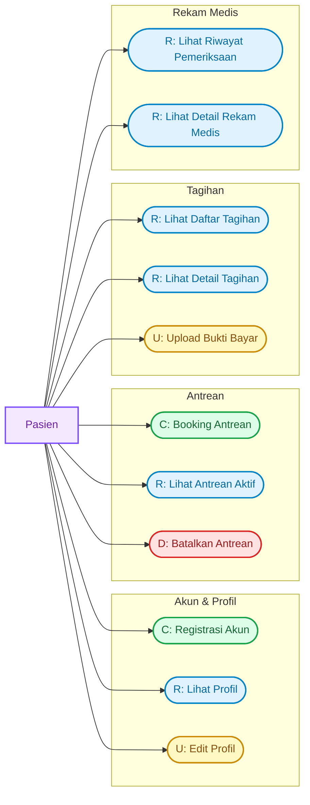
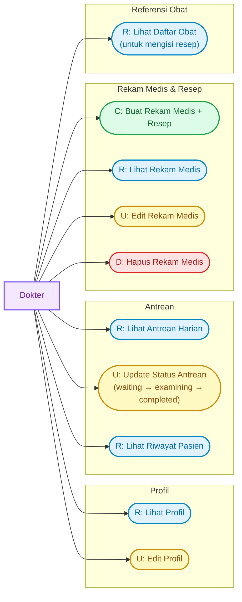
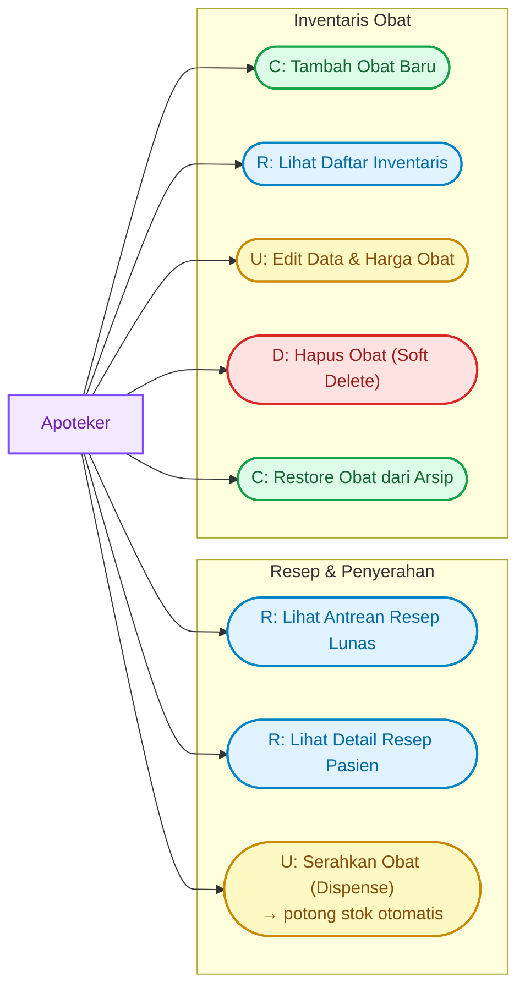

# 🗺️ Use Case Diagram NalaSeva — Fokus CRUD per Aktor

Dokumen ini menyajikan **Use Case Diagram berbasis operasi CRUD** (Create, Read, Update, Delete) untuk sistem **NalaSeva** (Aplikasi Manajemen Antrean & Rekam Medis Puskesmas Digital). Setiap use case dipetakan dari fitur nyata yang dimiliki masing-masing aktor sesuai `FITUR_PER_AKTOR.md`.

---

## 👥 Aktor Sistem

| Aktor | Deskripsi |
|---|---|
| **Pasien** | Pengguna akhir — registrasi mandiri, booking antrean, kelola profil, lihat rekam medis, kelola tagihan |
| **Dokter** | Tenaga medis — kelola profil, buat & edit rekam medis, proses antrean |
| **Apoteker** | Tenaga apotek — kelola inventaris obat, proses penyerahan obat |
| **Admin** | Pengelola sistem — CRUD semua data master (dokter, jadwal, cuti, poliklinik, user, pasien, obat), kelola antrean, verifikasi pembayaran, pengaturan sistem |

---

## 📊 1. Diagram Utama — CRUD Use Cases per Aktor

```mermaid
flowchart LR
  classDef actorStyle fill:#f3e8ff,stroke:#7c4dff,stroke-width:2px,color:#6b21a8;
  classDef usecaseStyle fill:#e0f2fe,stroke:#0284c7,stroke-width:2px,color:#0369a1;

  subgraph NalaSeva ["Sistem NalaSeva (CRUD)"]

    subgraph Modul_Auth ["Akun & Profil"]
      UC1(("Registrasi Akun")):::usecaseStyle
      UC2(("Login / Logout")):::usecaseStyle
      UC3(("Lihat & Edit Profil")):::usecaseStyle
      UC4(("Reset Password")):::usecaseStyle
    end

    subgraph Modul_Antrean ["Manajemen Antrean"]
      UC5(("Buat Antrean\n(Booking)")):::usecaseStyle
      UC6(("Lihat Antrean")):::usecaseStyle
      UC7(("Batalkan Antrean\n(Delete)")):::usecaseStyle
      UC8(("Update Status\nAntrean")):::usecaseStyle
    end

    subgraph Modul_Medis ["Rekam Medis"]
      UC9(("Buat Rekam Medis")):::usecaseStyle
      UC10(("Lihat Rekam Medis")):::usecaseStyle
      UC11(("Edit Rekam Medis")):::usecaseStyle
      UC12(("Hapus Rekam Medis")):::usecaseStyle
    end

    subgraph Modul_Tagihan ["Tagihan & Pembayaran"]
      UC13(("Lihat Tagihan")):::usecaseStyle
      UC14(("Upload Bukti Bayar")):::usecaseStyle
      UC15(("Verifikasi Pembayaran")):::usecaseStyle
    end

    subgraph Modul_Obat ["Inventaris Obat"]
      UC16(("Tambah Obat")):::usecaseStyle
      UC17(("Lihat Daftar Obat")):::usecaseStyle
      UC18(("Edit Data Obat")):::usecaseStyle
      UC19(("Hapus / Restore Obat")):::usecaseStyle
    end

    subgraph Modul_Master ["Data Master (Admin)"]
      UC20(("CRUD Dokter")):::usecaseStyle
      UC21(("CRUD Jadwal Dokter")):::usecaseStyle
      UC22(("CRUD Cuti Dokter")):::usecaseStyle
      UC23(("CRUD Hari Libur")):::usecaseStyle
      UC24(("CRUD Poliklinik")):::usecaseStyle
      UC25(("CRUD User")):::usecaseStyle
      UC26(("CRUD Pasien")):::usecaseStyle
    end

    subgraph Modul_Pengaturan ["Pengaturan Sistem"]
      UC27(("Lihat & Edit\nPengaturan Sistem")):::usecaseStyle
      UC28(("Update Profil\nPuskesmas")):::usecaseStyle
    end

  end

  %% Actors
  Pasien[Pasien]:::actorStyle
  Dokter[Dokter]:::actorStyle
  Apoteker[Apoteker]:::actorStyle
  AdminActor[Admin]:::actorStyle

  %% Pasien
  Pasien --> UC1
  Pasien --> UC2
  Pasien --> UC3
  Pasien --> UC4
  Pasien --> UC5
  Pasien --> UC6
  Pasien --> UC7
  Pasien --> UC10
  Pasien --> UC13
  Pasien --> UC14

  %% Dokter
  Dokter --> UC2
  Dokter --> UC3
  Dokter --> UC6
  Dokter --> UC8
  Dokter --> UC9
  Dokter --> UC10
  Dokter --> UC11
  Dokter --> UC12
  Dokter --> UC17

  %% Apoteker
  Apoteker --> UC2
  Apoteker --> UC16
  Apoteker --> UC17
  Apoteker --> UC18
  Apoteker --> UC19

  %% Admin
  AdminActor --> UC2
  AdminActor --> UC5
  AdminActor --> UC6
  AdminActor --> UC7
  AdminActor --> UC8
  AdminActor --> UC10
  AdminActor --> UC11
  AdminActor --> UC12
  AdminActor --> UC13
  AdminActor --> UC15
  AdminActor --> UC16
  AdminActor --> UC17
  AdminActor --> UC18
  AdminActor --> UC19
  AdminActor --> UC20
  AdminActor --> UC21
  AdminActor --> UC22
  AdminActor --> UC23
  AdminActor --> UC24
  AdminActor --> UC25
  AdminActor --> UC26
  AdminActor --> UC27
  AdminActor --> UC28
```

---

## 📂 2. Sub-Sistem CRUD Terperinci per Aktor

### 👤 Sub-Sistem 1: Pasien — CRUD Akun, Antrean & Tagihan

---

### 🩺 Sub-Sistem 2: Dokter — CRUD Rekam Medis & Resep

---

### 💊 Sub-Sistem 3: Apoteker — CRUD Inventaris Obat & Serah Obat

---

### 👑 Sub-Sistem 4: Admin — CRUD Data Master & Pengelolaan Sistem

```mermaid
flowchart LR
  classDef actorStyle fill:#f3e8ff,stroke:#7c4dff,stroke-width:2px,color:#6b21a8;
  classDef cStyle fill:#dcfce7,stroke:#16a34a,stroke-width:2px,color:#166534;
  classDef rStyle fill:#e0f2fe,stroke:#0284c7,stroke-width:2px,color:#0369a1;
  classDef uStyle fill:#fef9c3,stroke:#ca8a04,stroke-width:2px,color:#854d0e;
  classDef dStyle fill:#fee2e2,stroke:#dc2626,stroke-width:2px,color:#991b1b;

  Admin[Admin]:::actorStyle

  subgraph Dokter_M ["CRUD Dokter"]
    C1(["C: Tambah Dokter"]):::cStyle
    R1(["R: Lihat Daftar Dokter"]):::rStyle
    U1(["U: Edit Data Dokter"]):::uStyle
    D1(["D: Hapus Dokter (Soft Delete)"]):::dStyle
    C1r(["C: Restore Dokter"]):::cStyle
  end

  subgraph Jadwal_M ["CRUD Jadwal Praktik"]
    C2(["C: Tambah Jadwal"]):::cStyle
    R2(["R: Lihat Jadwal + Kuota"]):::rStyle
    U2(["U: Edit Jadwal"]):::uStyle
    D2(["D: Hapus Jadwal"]):::dStyle
  end

  subgraph Cuti_M ["CRUD Cuti Dokter"]
    C3(["C: Tambah Cuti\n→ auto-cancel antrean"]):::cStyle
    R3(["R: Lihat Data Cuti"]):::rStyle
    D3(["D: Hapus Data Cuti"]):::dStyle
  end

  subgraph Libur_M ["CRUD Hari Libur"]
    C4(["C: Tambah Hari Libur\n→ mass-cancel antrean"]):::cStyle
    R4(["R: Lihat Hari Libur"]):::rStyle
    D4(["D: Hapus Hari Libur"]):::dStyle
  end

  subgraph Poli_M ["CRUD Poliklinik"]
    C5(["C: Tambah Poliklinik"]):::cStyle
    R5(["R: Lihat Daftar Poliklinik"]):::rStyle
    U5(["U: Edit Poliklinik"]):::uStyle
    D5(["D: Hapus Poliklinik (Soft Delete)"]):::dStyle
  end

  subgraph User_M ["CRUD User & Pasien"]
    C6(["C: Tambah User / Pasien"]):::cStyle
    R6(["R: Lihat Daftar User / Pasien"]):::rStyle
    U6(["U: Edit Data User / Pasien"]):::uStyle
    D6(["D: Hapus User / Pasien (Soft Delete)"]):::dStyle
  end

  subgraph Antrean_M ["Kelola Antrean"]
    C7(["C: Booking Manual (Walk-In)"]):::cStyle
    R7(["R: Lihat Semua Antrean"]):::rStyle
    U7(["U: Update Status Antrean"]):::uStyle
    D7(["D: Batalkan / Hapus Antrean"]):::dStyle
  end

  subgraph RekamMedis_M ["Kelola Rekam Medis"]
    R8(["R: Lihat Semua Rekam Medis"]):::rStyle
    U8(["U: Edit Rekam Medis (Override)"]):::uStyle
    D8(["D: Hapus Rekam Medis (Override)"]):::dStyle
  end

  subgraph Tagihan_M ["Kelola Pembayaran"]
    R9(["R: Lihat Semua Tagihan"]):::rStyle
    U9(["U: Verifikasi Bukti Transfer"]):::uStyle
    U10(["U: Proses Pembayaran Tunai"]):::uStyle
  end

  subgraph Obat_M ["CRUD Obat (Shared Apoteker)"]
    C8(["C: Tambah Obat"]):::cStyle
    R10(["R: Lihat Inventaris Obat"]):::rStyle
    U11(["U: Edit Data Obat"]):::uStyle
    D9(["D: Hapus / Restore Obat"]):::dStyle
  end

  subgraph Sistem_M ["Pengaturan Sistem"]
    R11(["R: Lihat Pengaturan"]):::rStyle
    U12(["U: Edit Pengaturan Sistem\n(biaya, durasi slot)"]):::uStyle
    U13(["U: Update Profil Puskesmas\n(nama, alamat, koordinat)"]):::uStyle
  end

  Admin --> C1
  Admin --> R1
  Admin --> U1
  Admin --> D1
  Admin --> C1r
  Admin --> C2
  Admin --> R2
  Admin --> U2
  Admin --> D2
  Admin --> C3
  Admin --> R3
  Admin --> D3
  Admin --> C4
  Admin --> R4
  Admin --> D4
  Admin --> C5
  Admin --> R5
  Admin --> U5
  Admin --> D5
  Admin --> C6
  Admin --> R6
  Admin --> U6
  Admin --> D6
  Admin --> C7
  Admin --> R7
  Admin --> U7
  Admin --> D7
  Admin --> R8
  Admin --> U8
  Admin --> D8
  Admin --> R9
  Admin --> U9
  Admin --> U10
  Admin --> C8
  Admin --> R10
  Admin --> U11
  Admin --> D9
  Admin --> R11
  Admin --> U12
  Admin --> U13
```

---

## 📋 3. Ringkasan Tabel CRUD per Aktor

| Entitas / Fitur | Pasien | Dokter | Apoteker | Admin |
|---|:---:|:---:|:---:|:---:|
| **Akun (Registrasi)** | C | — | — | C |
| **Profil Sendiri** | RU | RU | — | RU |
| **Password** | U | U | U | U |
| **Antrean** | C, R, D | R, U | — | C, R, U, D |
| **Rekam Medis** | R | C, R, U, D | — | R, U, D |
| **Tagihan / Pembayaran** | R, U* | — | — | R, U |
| **Bukti Bayar** | U (upload) | — | — | U (verifikasi) |
| **Resep / Penyerahan Obat** | — | — | R, U | R, U |
| **Inventaris Obat** | — | R | C, R, U, D | C, R, U, D |
| **Dokter** | — | — | — | C, R, U, D |
| **Jadwal Praktik** | — | — | — | C, R, U, D |
| **Cuti Dokter** | — | — | — | C, R, D |
| **Hari Libur** | — | — | — | C, R, D |
| **Poliklinik** | — | — | — | C, R, U, D |
| **User** | — | — | — | C, R, U, D |
| **Pasien (Data Master)** | — | — | — | C, R, U, D |
| **Pengaturan Sistem** | — | — | — | R, U |
| **Profil Puskesmas** | R | R | R | R, U |

> *U untuk Tagihan (Pasien) = Upload bukti pembayaran*

---

## 🔌 4. Mapping Endpoint API per Operasi CRUD

| Operasi CRUD | Endpoint Laravel REST API | Aktor |
|---|---|---|
| **C** Registrasi Akun | `POST /api/auth/register` | Pasien |
| **R** Profil Akun | `GET /api/auth/profile` | Semua |
| **U** Update Profil | `POST /api/auth/update-profile` | Semua |
| **U** Reset Password | `POST /api/auth/forgot-password` | Semua |
| **C** Booking Antrean | `POST /api/queues` | Pasien, Admin |
| **R** Lihat Antrean | `GET /api/queues` | Semua |
| **U** Update Status Antrean | `PUT /api/queues/{id}` | Dokter, Admin |
| **D** Batalkan Antrean | `DELETE /api/queues/{id}` | Pasien, Admin |
| **C** Buat Rekam Medis | `POST /api/examinations` | Dokter |
| **R** Lihat Rekam Medis | `GET /api/examinations` | Pasien, Dokter, Admin |
| **U** Edit Rekam Medis | `PUT /api/examinations/{id}` | Dokter, Admin |
| **D** Hapus Rekam Medis | `DELETE /api/examinations/{id}` | Dokter, Admin |
| **R** Lihat Tagihan | `GET /api/payments` | Pasien, Admin |
| **U** Upload Bukti Bayar | `POST /api/payments/{id}/upload-proof` | Pasien |
| **U** Verifikasi Transfer | `POST /api/payments/{id}/verify` | Admin |
| **U** Bayar Tunai | `POST /api/payments/{id}/cash-pay` | Admin |
| **R** Lihat Resep Apotek | `GET /api/pharmacy/queues` | Apoteker, Admin |
| **U** Serahkan Obat | `POST /api/pharmacy/queues/{id}/dispense` | Apoteker, Admin |
| **C** Tambah Obat | `POST /api/medicines` | Apoteker, Admin |
| **R** Lihat Obat | `GET /api/medicines` | Dokter, Apoteker, Admin |
| **U** Edit Obat | `PUT /api/medicines/{id}` | Apoteker, Admin |
| **D** Hapus Obat | `DELETE /api/medicines/{id}` | Apoteker, Admin |
| **C** Restore Obat | `POST /api/medicines/{id}/restore` | Apoteker, Admin |
| **C** Tambah Dokter | `POST /api/doctors` | Admin |
| **U** Edit Dokter | `PUT /api/doctors/{id}` | Admin |
| **D** Hapus Dokter | `DELETE /api/doctors/{id}` | Admin |
| **C** Tambah Jadwal | `POST /api/doctor-schedules` | Admin |
| **R** Lihat Jadwal | `GET /api/doctor-schedules` | Admin |
| **U** Edit Jadwal | `PUT /api/doctor-schedules/{id}` | Admin |
| **D** Hapus Jadwal | `DELETE /api/doctor-schedules/{id}` | Admin |
| **C** Tambah Cuti | `POST /api/doctor-leaves` | Admin |
| **D** Hapus Cuti | `DELETE /api/doctor-leaves/{id}` | Admin |
| **C** Tambah Hari Libur | `POST /api/clinic-holidays` | Admin |
| **D** Hapus Hari Libur | `DELETE /api/clinic-holidays/{id}` | Admin |
| **C** Tambah Poliklinik | `POST /api/polyclinics` | Admin |
| **U** Edit Poliklinik | `PUT /api/polyclinics/{id}` | Admin |
| **D** Hapus Poliklinik | `DELETE /api/polyclinics/{id}` | Admin |
| **C** Tambah User | `POST /api/users` | Admin |
| **U** Edit User | `PUT /api/users/{id}` | Admin |
| **D** Hapus User | `DELETE /api/users/{id}` | Admin |
| **C** Tambah Pasien | `POST /api/patients` | Admin |
| **U** Edit Pasien | `PUT /api/patients/{id}` | Admin |
| **D** Hapus Pasien | `DELETE /api/patients/{id}` | Admin |
| **R** Lihat Pengaturan | `GET /api/settings` | Admin |
| **U** Edit Pengaturan | `PUT /api/settings` | Admin |
| **R** Profil Puskesmas | `GET /api/puskesmas-profile` | Semua |
| **U** Update Profil Puskesmas | `PUT /api/puskesmas-profile` | Admin |

---

*Dokumen ini merupakan Use Case Diagram resmi sistem NalaSeva — fokus CRUD per aktor.*  
*Diperbarui: 3 Juni 2026 — Disinkronkan penuh dengan `FITUR_PER_AKTOR.md`.*
