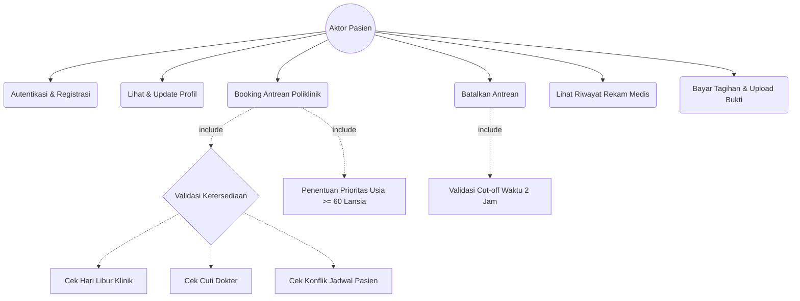
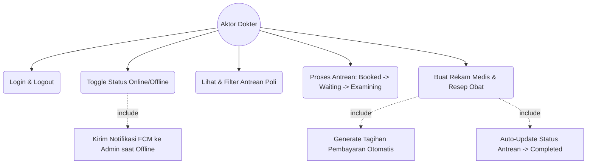
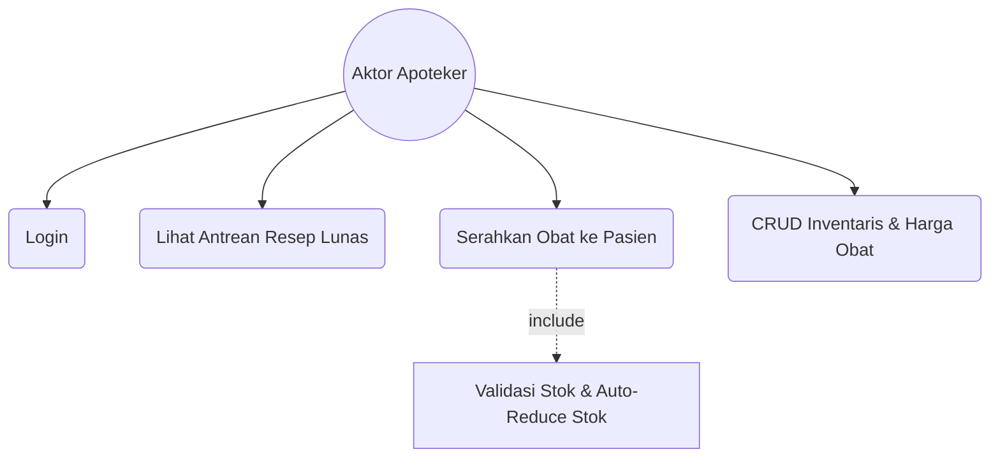
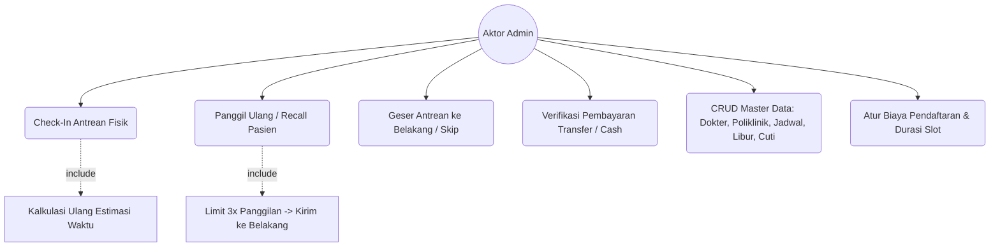

# 🗺️ Use Case Diagram NalaSeva (Flutter & Laravel REST API)

Dokumen ini menyajikan **Use Case Diagram** komprehensif untuk sistem **NalaSeva** (Aplikasi Manajemen Antrean & Rekam Medis Puskesmas Digital). Rancangan ini didasarkan pada integrasi antara aplikasi mobile **Flutter (Client)** dan **Laravel REST API (Backend)**.

---

## 👥 Aktor Sistem (Actors)

Sistem NalaSeva memiliki **4 Aktor Utama** dengan peran dan hak akses berbasis *Role-Based Access Control* (RBAC) yang terdefinisi dengan jelas:

| Aktor | Deskripsi Peran | Platform Utama |
|---|---|---|
| **Pasien (Patient)** | Pengguna puskesmas yang mendaftar secara mandiri untuk memesan antrean poliklinik, memantau estimasi antrean secara real-time, mengunggah bukti pembayaran, dan melihat riwayat pemeriksaan medis mereka. | Flutter Mobile |
| **Dokter (Doctor)** | Tenaga medis yang memproses antrean pemeriksaan, memperbarui status kehadiran/online, dan membuat rekam medis (pemeriksaan) beserta resep obat untuk pasien. | Flutter Mobile |
| **Apoteker (Pharmacist)** | Tenaga kesehatan yang mengelola inventaris obat, melihat antrean resep obat yang sudah dibayar, serta melakukan verifikasi penyerahan obat (dispensing). | Flutter Mobile |
| **Admin** | Pengelola sistem dengan akses penuh untuk mengelola master data (user, poliklinik, dokter, jadwal, hari libur), melakukan verifikasi pembayaran, serta mengoperasikan manajemen fisik antrean di loket (Check-In, Recall, Skip). | Flutter Mobile / Web / API |

---

## 📊 1. Diagram Kasus Penggunaan Utama (System Use Cases Overview)

Berikut adalah diagram besar seluruh use case pada sistem **NalaSeva** menggunakan notasi **Mermaid.js**:

```mermaid
flowchart LR
  classDef actorStyle fill:#2a2b36,stroke:#7c4dff,stroke-width:2px,color:#fff;
  classDef usecaseStyle fill:#1e1e24,stroke:#39ff14,stroke-width:1.5px,color:#fff;
  
  subgraph NalaSeva System Boundary
    %% Authentication & Profile
    UC1((Autentikasi & Akun)):::usecaseStyle
    UC2((Kelola Profil)):::usecaseStyle
    
    %% Patient Flow
    UC3((Booking Antrean)):::usecaseStyle
    UC4((Batalkan Antrean)):::usecaseStyle
    UC5((Bayar Tagihan & Resep)):::usecaseStyle
    
    %% Doctor Flow
    UC6((Update Status Online)):::usecaseStyle
    UC7((Proses Antrean)):::usecaseStyle
    UC8((Buat Rekam Medis)):::usecaseStyle
    
    %% Pharmacist Flow
    UC9((Serahkan Obat)):::usecaseStyle
    UC10((CRUD Inventaris Obat)):::usecaseStyle
    
    %% Admin Flow
    UC11((Manajemen Fisik Antrean)):::usecaseStyle
    UC12((CRUD Master Data)):::usecaseStyle
    UC13((Verifikasi Pembayaran)):::usecaseStyle
    UC14((Atur Pengaturan Dinamis)):::usecaseStyle
  end

  %% Actors
  Pasien[Pasien]:::actorStyle
  Dokter[Dokter]:::actorStyle
  Apoteker[Apoteker]:::actorStyle
  AdminActor[Admin]:::actorStyle

  %% Relations
  Pasien --> UC1
  Pasien --> UC2
  Pasien --> UC3
  Pasien --> UC4
  Pasien --> UC5

  Dokter --> UC1
  Dokter --> UC2
  Dokter --> UC6
  Dokter --> UC7
  Dokter --> UC8

  Apoteker --> UC1
  Apoteker --> UC9
  Apoteker --> UC10

  AdminActor --> UC1
  AdminActor --> UC11
  AdminActor --> UC12
  AdminActor --> UC13
  AdminActor --> UC14
  AdminActor --> UC10
```

---

## 📂 2. Use Case Terperinci per Aktor

### 📱 A. Kasus Penggunaan: Pasien (Patient)

Pasien fokus pada pemesanan antrean secara mandiri (Booking H-7), pemantauan estimasi waktu pelayanan adaptif (kalkulasi 3 pemeriksaan terakhir), dan pembayaran tagihan pasca-pemeriksaan.

### 🩺 B. Kasus Penggunaan: Dokter (Doctor)

Dokter berinteraksi dengan antrean polikliniknya masing-masing, mengontrol ketersediaan melalui status online, dan mengisi hasil diagnosis medis yang secara otomatis memicu tagihan pembayaran.

### 💊 C. Kasus Penggunaan: Apoteker (Pharmacist)

Apoteker bertanggung jawab memproses resep obat dari rekam medis yang **telah lunas** dan memastikan kecukupan inventaris obat di apotek.

### ⚙️ D. Kasus Penggunaan: Admin

Admin memegang kendali atas operasional fisik di puskesmas (seperti check-in loket fisik), memverifikasi pembayaran non-tunai, dan mengatur parameter dinamis puskesmas.

---

## 🔌 3. Pemetaan Teknis: Flutter UI & Laravel REST API Endpoints

Berikut adalah tabel integrasi yang memetakan setiap **Use Case** di aplikasi mobile **Flutter** ke endpoint **Laravel REST API** yang bersangkutan:

| Nama Use Case | Fitur Flutter (`Provider` / `Screen`) | Endpoint REST API (Laravel) |
|---|---|---|
| **Registrasi Pasien** | `AuthProvider` / `RegisterScreen` | `POST /api/auth/register` |
| **Login Pengguna** | `AuthProvider` / `LoginScreen` | `POST /api/auth/login` |
| **Lupa Password (OTP)** | `AuthProvider` / `ForgotPasswordScreen` | `POST /api/auth/forgot-password/otp` (Request) `POST /api/auth/forgot-password` (Reset) |
| **Lihat & Update Profil** | `AuthProvider` / `ProfileScreen` | `GET /api/auth/profile` `PUT /api/auth/update-profile` |
| **Booking Antrean** | `PatientProvider` / `BookingScreen` | `POST /api/queues` |
| **Batalkan Antrean** | `PatientProvider` / `MyQueueScreen` | `DELETE /api/queues/{id}` |
| **Update Status Online** | `DoctorProvider` / `DoctorDashboardScreen` | `PATCH /api/doctors/me/status` |
| **Proses Antrean Dokter** | `DoctorProvider` / `QueueManagementScreen` | `PUT /api/queues/{id}` |
| **Buat Rekam Medis** | `DoctorProvider` / `MedicalRecordForm` | `POST /api/examinations` |
| **Lihat Riwayat Medis** | `PatientProvider` / `MedicalHistoryScreen` | `GET /api/examinations` |
| **Lihat Resep & Tagihan**| `PatientProvider` / `PaymentDetailScreen` | `GET /api/payments` |
| **Upload Bukti Bayar** | `PatientProvider` / `PaymentDetailScreen` | `POST /api/payments/{id}/upload-proof` |
| **Check-In Loket** | `AdminProvider` / `AdminQueueScreen` | `POST /api/queues/{id}/checkin` |
| **Recall / Panggil Ulang**| `AdminProvider` / `AdminQueueScreen` | `POST /api/queues/{id}/recall` |
| **Skip / Geser Antrean** | `AdminProvider` / `AdminQueueScreen` | `POST /api/queues/{id}/skip` |
| **Verifikasi Pembayaran**| `AdminProvider` / `PaymentVerificationScreen`| `POST /api/payments/{id}/verify` |
| **Serahkan Obat** | `PharmacyProvider` / `PharmacyDashboardScreen`| `POST /api/pharmacy/queues/{id}/dispense` |
| **Pengaturan Dinamis** | `AdminProvider` / `AdminSettingsScreen` | `GET /api/settings` `PUT /api/settings` |

---

## 🔒 4. Validasi Utama & Logika Bisnis yang Terkait

Setiap use case di atas dikontrol ketat oleh aturan bisnis di tingkat API (*Service Layer*):

1. **Anti-IDOR (Insecure Direct Object Reference):** Pasien hanya bisa mengakses data antrean, rekam medis, dan pembayaran milik mereka sendiri (`patient_id` divalidasi silang dengan user token).
2. **Mesin Status Antrean (State Machine):** Status antrean dipaksa mengikuti alur linear: `booked` ➡️ `waiting` ➡️ `examining` ➡️ `completed`. Transisi di luar alur ini akan otomatis ditolak.
3. **Kalkulasi Estimasi Waktu Adaptif:** Setiap check-in, recall, skip, atau booking baru akan memicu fungsi `recalculateEstimatedTimes()` untuk memproyeksikan jam pelayanan pasien secara akurat menggunakan durasi slot dinamis dari pengaturan puskesmas.
4. **Keamanan Transaksi Farmasi:** Pengurangan stok obat saat "Serahkan Obat" berjalan dalam transaksi database (`DB::beginTransaction`). Jika ada satu obat dalam resep yang stoknya kurang, transaksi digagalkan secara keseluruhan untuk menghindari ketidakkonsistenan data.
